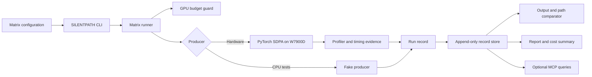
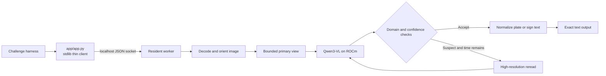
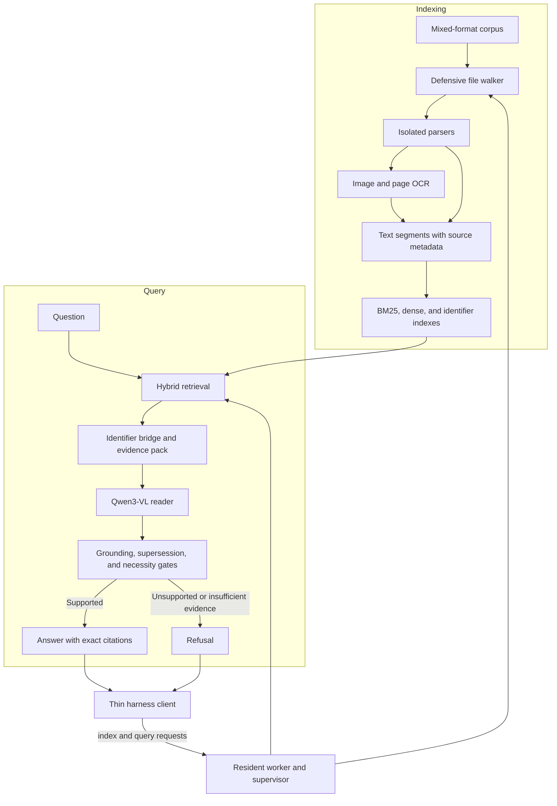

# AMD AI Challenge Projects: SILENTPATH, ROADREAD, and SOURCEBOUND

This repository contains three separate AMD challenge entries. **SILENTPATH** is the main-track inference-path measurement tool, **ROADREAD** is the Mini-Challenge 2 road-sign and license-plate OCR entry, and **SOURCEBOUND** is the Mini-Challenge 3 grounded RAG system. Each has its own implementation, evaluation evidence, and limitations.

| Entry | Challenge | What it does | Evidence |
|---|---|---|---|
| [SILENTPATH](#silentpath--main-track-d1) | Main track | Measures PyTorch SDPA execution paths, output divergence, and runtime cost on AMD ROCm. | [W7900D evidence](docs/evidence/silentpath-w7900/README.md) |
| [ROADREAD](#roadread--mini-challenge-2) | Mini Challenge 2 | Reads license plates and road signs from difficult images and returns normalized text. | [GPU results](results/dev.md) |
| [SOURCEBOUND](#sourcebound--mini-challenge-3) | Mini Challenge 3 | Answers questions over mixed-format documents with grounded, exact citations. | [Release verification](results/mc3-release.md) |

## SILENTPATH — main-track D1

SILENTPATH records which PyTorch SDPA attention operator ran, compares repeated inference results and timings, and keeps profiler evidence beside each record. D1 currently supports PyTorch ROCm SDPA on the AMD Radeon Pro W7900D. It does not claim that every silent fallback is detected, and it does not claim general answer-quality or speed improvements.

### Architecture

The same runner can drive the real ROCm producer or the deterministic fake producer. Both write the same run-record format, which feeds comparison, reporting, and optional MCP queries.



### Current measured result

On Qwen2.5-1.5B-Instruct at pinned revision `989aa7980e4cf806f80c7fef2b1adb7bc71aa306`, the W7900D profiler distinguished forced Flash Attention from Math. For two prompts with `max_new_tokens=128` and five repetitions per cell, Math was 1.30–1.36× slower than Flash in the first session; a fresh reversed-order session measured 1.292× and 1.299× on the two prompts. The short generated sequence first differed at token 65 in both sessions, while the long sequence matched. These results are limited to these prompts and this runtime. No chosen-token log-probabilities were collected, and no positive silent fallback was observed. Default dispatch used Flash in the profiler, but the comparator currently leaves Default versus Flash unresolved.

The complete records, reports, environment manifest, representative traces, archive hashes, and reproduction notes are in [`docs/evidence/silentpath-w7900/`](docs/evidence/silentpath-w7900/README.md). The current W7900D runtime versions were Python 3.14.4, PyTorch `2.13.0+rocm10.0.0`, ROCm/HIP 10.0.0/7.15.26333, and Transformers 5.17.0.

The separate initial G1 arithmetic run produced identical `1064.875` text and token IDs for one Flash and one Math run, with a maximum chosen-token log-probability delta of `0.0086715`. Its backend labels were request-derived and lack independent profiler confirmation; one timing per backend is not a performance result. See [`results/g1/README.md`](results/g1/README.md).

### Quickstart: GPU-free demo

Python 3.10 or newer is required. Install the pinned user-space dependencies:

```bash
python -m venv .venv
# Activate .venv using the command for your shell.
python -m pip install -r requirements-silentpath.lock
```

Run a small fake matrix and report its stored comparisons:

```bash
python -m silentpath.cli run --matrix configs/smoke.yaml --out runs/silentpath-smoke --cap-hours 1 --fake
python -m silentpath.cli report --out runs/silentpath-smoke
```

The fake producer verifies the CLI, matrix runner, record store, comparator, and report. It does not emulate GPU dispatch or validate performance.

For a presentation-ready walkthrough of the CLI, report, and both MCP query functions, run `./tools/demo-silentpath.ps1` in PowerShell. It writes each run to its own ignored `runs/silentpath-demo-<timestamp>/` directory. The timed [2:20 video script](docs/demo-script.md) shows how to pair it with the real profiler evidence.

### Reproduce the real W7900D example

Use the AMD ROCm/PyTorch image recorded in [`environment.json`](docs/evidence/silentpath-w7900/environment.json), a W7900D, and the Qwen snapshot at the revision above. PyTorch must come from the ROCm image; **do not install a PyPI CUDA or CPU build of Torch over it**. The tracked session config files contain the exact prompts and repetition counts. The model identifier in the configs resolves through the Hugging Face cache to the pinned snapshot used for the published evidence.

```bash
python -m pip install --no-deps -r requirements-silentpath-gpu.lock
python -m silentpath.cli run --matrix configs/w7900-prefill.yaml --out runs/w7900-prefill --cap-hours 0.5 --producer sdpa
python -m silentpath.cli report --out runs/w7900-prefill
python -m silentpath.cli run --matrix configs/w7900-decode.yaml --out runs/w7900-decode --cap-hours 0.5 --producer sdpa
python -m silentpath.cli report --out runs/w7900-decode
```

For the optional MCP transport, install the project extra with `python -m pip install -e ".[mcp]"` and run `python -m silentpath.mcp_server`. The plain `which_path` and `summarise_store` functions can also be called directly and are covered by tests. A networked MCP transport was not part of the recorded GPU validation.

### Limitations

- vLLM is deferred; the real producer currently supports PyTorch SDPA.
- Runtime-path confidence is based on captured PyTorch profiler operator names. This is one evidence source, reported as such.
- `DEFAULT` and forced Flash are not yet treated as comparator aliases, even though the captured profiler showed Flash for default dispatch.
- Performance and output observations are workload-specific. The short sequence token difference is not an invoice-accuracy or general answer-quality result.
- The published prefill measurements generate one token and are preliminary. Decode measurements cover two prompts with five repetitions per backend.
- Notebook quota is wall-clock pod time and is not enforced by the per-cell `--cap-hours` budget.
- This repository does not include a recorded narration/video yet; the runnable walkthrough and saved GPU evidence are ready to record.

## ROADREAD — Mini-Challenge 2

ROADREAD is the separate AMD ROCm vision OCR project for license plates and road signs. It uses a thin evaluator client, resident model worker, and domain-specific normalization. Its implementation is in the `roadread/`, `app/`, and `docker/` directories. The preserved [ROADREAD project README](docs/roadread/README.md) describes its evaluation constraints; the challenge brief is in [`docs/hackathon-brief.md`](docs/hackathon-brief.md). Those results do not validate SILENTPATH's inference-path claims.

### Architecture

The evaluator starts a lightweight client for each image. The client sends the image path to a resident GPU worker, which decodes bounded image views, runs Qwen3-VL on ROCm, and escalates to a higher-resolution reread only when validation indicates the first result may be wrong.



The reference images scored **10/10 exact match**. On the 120-image synthetic development benchmark, ROADREAD scored **109/120 (90.8%)** with zero recorded contract violations; warning-sign cases were the weakest slice. See the [detailed benchmark](results/dev.md).

## SOURCEBOUND — Mini-Challenge 3

SOURCEBOUND is the exact-citation mixed-format RAG entry. Its specification, GPU evidence, and release verification are recorded in [`docs/MINI_CHALLENGE_3_SPEC.md`](docs/MINI_CHALLENGE_3_SPEC.md), [`results/mc3-e4-holdout-scale.md`](results/mc3-e4-holdout-scale.md), and [`results/mc3-release.md`](results/mc3-release.md).

### Architecture

Indexing extracts text and OCR from the supplied corpus, then builds lexical, dense, and identifier indexes. For each question, hybrid retrieval assembles evidence for the reader. Gates check grounding and document status before the client emits an answer with the necessary citations or a refusal.



The pinned 8B reader scored **10/10 on the starter kit** and **32/32 on the untouched holdout**. The release image passed CI publication and image checks. The W7900D rehearsal used the documented local-layer fallback because downloading the temporary registry tool on the pod was unreliable; the checkpointed kit and supervisor-recovery results are in [release verification](results/mc3-release.md). The release reference is intentionally not printed in this README.

## Repository map

| Path | Contents |
|---|---|
| `silentpath/` | Records, matrix runner, SDPA producer, CLI, reporter, MCP functions |
| `configs/` | Fake smoke matrix and W7900D prefill/decode matrices |
| `docs/evidence/silentpath-w7900/` | Real GPU run records, reports, metadata, selected traces, archive hashes |
| `roadread/`, `app/`, `docker/` | Separate ROADREAD Mini-Challenge 2 implementation |
| `docs/roadread/README.md` | ROADREAD Mini-Challenge 2 project guide |
| `sourcebound/`, `mc3/`, `eval_mc3/`, `release/` | SOURCEBOUND Mini-Challenge 3 implementation and evaluation |
| `results/mc3-release.md`, `results/mc3-scale.md` | SOURCEBOUND release and GPU scale evidence |
| `aidlc-docs/` | Project baseline, effort history, current release state |
| `tests/` | SILENTPATH, ROADREAD, and evaluation tests |

## Development checks

Install development dependencies and run the complete local test suite:

```bash
python -m pip install -e ".[dev]"
python -m pytest -q
```

## License and source

The repository is licensed under the [MIT License](LICENSE). SILENTPATH source: [feat/silentpath-w7900](https://github.com/HarshdipSaha/amdmega-hackathon/tree/feat/silentpath-w7900).

## Project status

SILENTPATH's GPU implementation and recorded measurements are complete. Clean-checkout packaging and the short demo/release submission are tracked in [Effort 012](aidlc-docs/efforts/012-silentpath-cli-mcp-verification/effort-state.md). The signed-in competition submission route and participant-only prize rules must be confirmed before reporting an entry as submitted.
