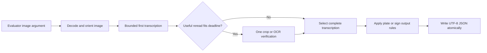

# ROADREAD — AMD Mini-Challenge 2 research and specification

**Written:** 23 September 2026. **Revision 2:** 24 September 2026 (research refresh; see [refresh notes](research/refresh-2026-09-24.md)). **Sources checked:** 22 and 24 September 2026. **Status:** research and proposed specification complete; application implementation and AMD measurements remain to be done.

**Recommendation:** build a focused English/Chinese license-plate and road-sign reader. Develop against **Qwen3-VL-4B-Instruct on the supplied ROCm PyTorch image** because it is small enough to iterate on inside the 25 GB persistent volume, then test **PaddleOCR-VL-1.6** as a compact alternative or verifier. Because every image is pass/fail and the per-image budget (30 s) is generous for a single short read, the **release** model should be the strongest **BF16** checkpoint that passes the packaging gates — expected to be **Qwen3.5-9B or Qwen3-VL-8B-Instruct** — not automatically the development model. Ship the simplest configuration that wins a representative, timed exact-match evaluation. Do not make training, a large ensemble, or a new serving stack prerequisites.

**What revision 2 changed.**

1. **Two new first-session gates** now decide the model tier before any accuracy work. First, the unpacked size of the mandated base image, which determines how many weight bytes fit under 60 GiB. Second, the allocated GPU architecture, which determines whether FP8 checkpoints are usable (§1, §8, Further Notes F–G).
2. **The model screen was refreshed.** The Qwen3.6 and Qwen3.8 families, Qwen-Drive-1.0-4B, and PP-OCRv6 postdate or were missed by the 22 September pass. None displaces the BF16 ≤ 9B tier on this hardware envelope (Further Notes D2).
3. **A survey of competing public entries** shows the field converging on small Qwen2/2.5-VL models (2–3B) behind a resident server. Model quality and measured evaluation are the available differentiators (Further Notes H).
4. **New papers change the escalation policy.** Use cross-view disagreement to *trigger* one extra read. Do not majority-vote perturbed views (§6, Further Notes C2).
5. **Two narrowly scoped domain rules were added:** a Chinese-registration format check, and I/O exclusion in the Chinese serial. A class of competitor heuristics that would corrupt repeated-digit plates is now explicitly forbidden (§5).

This document follows the requested global Claude `to-spec` structure. The requested deliverable is local Markdown. It consolidates the paper research, live Hugging Face screening, AMD feasibility audit, and the user's confirmed [COMPUTE.md](../COMPUTE.md). The controlling task source is the [13-page challenge PDF](../LabLab_AMD%20AI%20Challenge%20-%20Mini%20Challenge.pdf).

The previous [SILENTPATH specification](SPEC.md) remains a separate research proposal. This mini-challenge requires a working OCR submission; it does not depend on proving numerical differences between attention backends. The earlier assumption that all GPU work requires purchased MI300X hours is superseded for this task by the notebook access confirmed in `COMPUTE.md`.

## Problem Statement

The participant must return exactly the relevant text from previously unseen plates and signs, including degraded images. The difficult cases are character-level mistakes, small text, blur, glare, skew, reading order, and deciding which visible text belongs in the answer.

The distinction between a plate and a sign matters. A US plate needs its registration without a state banner or slogan. A Chinese plate retains its leading province character and letter. A speed-limit sign retains its printed words and number. A numeric advisory plaque receives no invented unit. These are explicit transcription rules, not interchangeable forms of generic document OCR. [Brief, pp. 6–7, 9–13]

There are **10 hidden images worth 20 points each**, scored by complete-string equality after the prescribed normalization. A wrong character loses that image's points. Container, timing, and GPU-memory violations can invalidate the entire submission. The published examples establish conventions, not the hidden distribution or an accuracy estimate. [Brief, pp. 4–7]

The available notebook has a **three-hour daily pod-lifetime quota** and approximately **25 GB persistent storage**. A practical solution must leave time for installation, downloads, testing, and saving work, and cannot assume a particular GPU family. [Compute; Brief, pp. 2–3]

## Solution

ROADREAD accepts one image, reads the target plate or sign, and writes the evaluator's JSON answer. A small resident multilingual model supplies the first transcription. Carefully bounded image processing or a second reader is added only when it improves complete-string accuracy under the same deadline.

### Approaches considered

| Approach | Advantage | Main limitation | Decision |
|---|---|---|---|
| One instruction-following VLM | Can apply different plate/sign transcription rules in one pipeline; simple deployment | May substitute plausible characters or miss small text | **Build this baseline first.** |
| Dedicated OCR/spotting model | Small weights; explicit text regions can help distinguish number lines from banners | Recognition alone does not reliably decide which text to exclude; runtime and model prompts vary | Compare PaddleOCR-VL-1.6; retain it if its full pipeline wins. |
| VLM plus conditional OCR verification | Potentially complementary visual evidence on difficult registrations | More dependencies, selection errors, memory, and latency | **Optional improvement**, accepted only through paired evaluation. |

The resident worker is an internal implementation proposal. The evaluator still invokes the required script; it is not asked to call a web API. Startup semantics must be checked before depending on that worker, as described below.

### Expected visible behavior

| Image content | Required text | Reason |
|---|---|---|
| US plate with `CALIFORNIA` above `7ABC123` | `7ABC123` | Exclude surrounding jurisdiction text. |
| Chinese registration `京A·12345` | `京A·12345` | Province and letter are part of the number. |
| Chinese registration `沪B·88888` | `沪B·88888` | Preserve the prefix and repeated digits. |
| Sign with `SPEED`, `LIMIT`, `65` on successive lines | `SPEED LIMIT 65` | All printed sign text belongs in the answer. |
| Sign with `ROAD`, `WORK`, `AHEAD` | `ROAD WORK AHEAD` | Join lines from top to bottom. |
| Advisory plaque containing only `35` | `35` | Do not append `MPH` or a label. |

These examples come from the brief and must never become an image-to-answer lookup table. Unseen registrations, numbers, wording, designs, and degradations belong in validation.

## User Stories

1. As an evaluator, I want to invoke the prescribed script with one image argument, so that the submission works with the existing harness.
2. As an evaluator, I want a correctly named JSON file for each input, so that predictions cannot be confused across images.
3. As an evaluator, I want the required `text` field to be a string, so that scoring does not depend on model-specific output formats.
4. As an evaluator, I want PNG, JPEG, and TIFF inputs to work, so that file format does not determine success.
5. As an evaluator, I want each invocation to finish within the deadline, so that one difficult image does not invalidate the run.
6. As an evaluator, I want inference to use the AMD GPU within the memory bounds, so that the submission satisfies the hardware requirement.
7. As a participant, I want to read a US registration without its banner or slogan, so that extra visible words do not spoil an otherwise correct answer.
8. As a participant, I want Chinese province characters preserved, so that the full registration is returned.
9. As a participant, I want repeated characters preserved, so that registrations such as repeated-digit plates are not shortened.
10. As a participant, I want all text on a road sign retained in reading order, so that multiline warnings are transcribed correctly.
11. As a participant, I want number-only signs returned without invented units, so that the answer matches the visible content.
12. As a participant, I want unusual registrations read literally, so that language-model spelling preferences do not replace the image evidence.
13. As a participant, I want aspect ratio and orientation handled correctly, so that preprocessing does not distort the characters.
14. As a participant, I want difficult regions reread at useful resolution, so that resizing a large image does not erase small text.
15. As a participant, I want any optional reread to respect the remaining time, so that an accuracy experiment cannot cause a timeout.
16. As a participant, I want model weights retained in the correct persistent directory, so that the next notebook session does not repeat unnecessary downloads.
17. As a participant, I want dependencies reproducibly restored, so that session replacement does not silently change the runtime.
18. As a participant, I want results saved incrementally, so that quota exhaustion does not destroy completed experiments.
19. As a developer, I want exact-match results separated by image category and degradation, so that an average does not conceal a broken Chinese or sign path.
20. As a developer, I want independent development and holdout images, so that model selection does not overfit the public examples.
21. As a developer, I want actual checkpoint sizes and revisions recorded, so that model names are not mistaken for disk or memory measurements.
22. As a developer, I want GPU identity, software versions, precision, prompts, and latency recorded together, so that results can be reproduced.
23. As a developer, I want malformed, empty, or truncated model outputs handled explicitly, so that they cannot masquerade as successful transcription.
24. As a participant, I want the final container tested in the evaluator's invocation pattern, so that notebook success also translates into a usable submission.
25. As a participant, I want an anonymously pullable image with the correct base layers, so that registry access and packaging do not invalidate the entry.
26. As a participant, I want the final image reference submitted through the intended channel without placing credentials or the reference in public source, so that I follow the brief's publication rules.
27. As a participant, I want the unpacked size of the mandated base measured in the first GPU session, so that I know how many weight bytes can ship inside the image before choosing a release model.
28. As a participant, I want the allocated GPU architecture recorded (CDNA versus RDNA, gfx target), so that I never depend on a precision or kernel that the grading GPU may lack.
29. As an evaluator, I want the per-image client to start quickly and avoid importing the model framework, so that interpreter startup does not eat into the 30-second budget.
30. As a participant, I want the resident worker started by the container's own startup command and ready before the first image, so that model loading is charged to the 10-minute startup budget rather than to image one.
31. As a participant, I want a Chinese registration checked against its known format, so that a malformed read is re-examined instead of submitted.
32. As a participant, I want repeated characters never collapsed by post-processing, so that registrations like `沪B·88888` survive intact.
33. As a participant, I want disagreement between two reads to trigger one more careful read, so that extra compute is spent only on images that are actually uncertain.
34. As a participant, I want the release model chosen by measured exact match, latency, and footprint on my own holdout, so that benchmark headlines and competitor choices do not substitute for evidence.
35. As a participant, I want a runtime weight-download path tested end to end within the startup budget, so that I have a working fallback if the chosen weights do not fit inside the image.

## Implementation Decisions

### 1. Model selection is an experiment with a clear default

- **Baseline:** `Qwen/Qwen3-VL-4B-Instruct`, using its official processor and native Transformers implementation. Its report provides bilingual OCR evidence and favors the Instruct variant over the corresponding Thinking variant on the cited OCR rows. This is a screening rationale, not a measured AMD result. [P1]
- **First compact challenger:** `PaddlePaddle/PaddleOCR-VL-1.6`. Evaluate direct `OCR:` on appropriate crops and `Spotting:` when localization is useful. Its native Transformers path can avoid the full Paddle document-layout pipeline. The official card distinguishes these tasks. [P2; M4]
- **Newer alternative:** `Qwen/Qwen3.5-4B`. Test only after the baseline is working. Its hybrid operations have a native PyTorch fallback in the inspected Transformers source, but their correctness, memory, and speed on this image remain to be measured. Disable thinking for bounded transcription. [M2; AMD audit]
- **Accuracy escalation:** evaluate Qwen3-VL-8B-Instruct or Qwen3.5-9B only if the smaller models have consequential residual errors and the larger checkpoint fits actual disk, memory, and timing budgets. Keep one large candidate at a time. [P1, P5]
- GLM-OCR and FireRed-OCR are reserve candidates. Screening additional models is lower priority than testing a complete baseline.
- **Tiering rule (revision 2).** Development tier: a 4B checkpoint (fits persistent storage alongside data and a second model). Release tier: the strongest checkpoint that passes **all** of the following, chosen by measured exact match. Size: the weights fit the image-size gate once the base is measured, or the runtime-download fallback is proven within startup. Precision: BF16/FP16 only. Memory: peak VRAM ≤ 44 GiB. Latency: worst-case invocation ≤ 25 s. The expected winner is a ~9B dense BF16 model (Qwen3.5-9B 19.3 GB, or Qwen3-VL-8B 17.5 GB), but this is a prediction to test, not a decision.
- **Precision must not depend on the GPU family.** The brief allocates "CDNA or RDNA" in development and does not name the grading GPU. The 48 GiB VRAM figure is consistent with a Radeon PRO W7900-class (RDNA3) card, whose hardware lacks the FP8 matrix support that MI300X-class CDNA3 parts have; this is an inference to verify in session 1, not a fact. Consequently **FP8 checkpoints are excluded from the release tier** unless the grading hardware is confirmed. That excludes Qwen3.6-35B-A3B-FP8 (37.5 GB), Qwen3.6/3.8-27B-FP8 (30.9 GB), and BF16 27B+ models (55+ GB, over the 48 GiB VRAM cap). GPTQ-Int4 variants are excluded unless a ROCm/Python 3.14 kernel path is demonstrated. [Further Notes D2]
- **Qwen3.5-family generation must run with thinking disabled** (`enable_thinking: false` in the chat template). Qwen3.5/3.6/3.8 cards document thinking mode as the default; an unbounded reasoning trace would breach the token cap and the deadline.
- Do not choose models by what competing entries use. The surveyed public entries use Qwen2-VL-2B, Qwen2.5-VL-3B, Florence-2-base, TrOCR, or EasyOCR. That is evidence of convenience, not of accuracy on the graded distribution. [Further Notes H]
- Freeze the winning checkpoint revision, processor, prompt, precision, dependency versions, and image-processing settings. No floating `main` checkpoint or unrecorded prompt changes in the release experiment.

### 2. Preserve the supplied ROCm runtime

Use the provided ROCm PyTorch installation with a compatible pinned Transformers version. The audit inspected Transformers **5.17.0**; this is a candidate version to validate, not a claim that installation and inference have already passed in the notebook.

Start with native SDPA where supported and test eager/math attention as a fallback. ROCm PyTorch uses the `torch.cuda` interface and `cuda` device name. Verify HIP availability, actual device placement, and useful GPU inference; silent CPU fallback is a failure. [AMD audit, A6–A8]

Do not copy CUDA installation commands from model cards, replace the supplied torch wheel indiscriminately, or make separately compiled FlashAttention a prerequisite. Current vLLM ROCm wheel evidence does not establish a drop-in match for the mandated Python/ROCm image. Use vLLM only if an exact compatible environment is demonstrated and it improves the measured result. [AMD audit, A5, A13–A16]

Start with BF16 if the allocated device supports it correctly; use a tested FP16 alternative if needed. Quantization, speculative decoding, and compilation are later options, not baseline requirements.

### 3. Keep the pipeline small and observable

Use four responsibilities: input decoding, model inference, transcription selection, and evaluator output. One recognition result carries the selected text plus internal diagnostic information: model revision, view used, elapsed time, and any failure or truncation indicator.

The evaluator-facing script is the highest-level test boundary. There is no existing OCR application or test suite in this repository to extend; the existing material is research and planning. Do not make the new solution depend on the unimplemented SILENTPATH measurement core.

### 4. Decode without throwing away useful evidence

Accept all three required formats, apply image orientation, and handle grayscale/palette/RGB inputs through a deliberate conversion path. Test TIFF decoding and any required codec support in the final image. Preserve aspect ratio.

Begin with a bounded full-image view. A starting experimental budget of roughly one megapixel and a short output cap is reasonable, but must be adjusted from measured small-character accuracy and latency. This is not a claim that all large images become readable at that size.

For difficult small text, reread a region from the original pixels. Rectify a plate only when a credible quadrilateral is available; retain the original view when localization is unreliable. Never crop off the leading Chinese character. Compare mild contrast adjustment against the original; do not make aggressive thresholding or learned image restoration unconditional. [P2, P6, P8]

### 5. Transcribe literally and select complete candidates

Use a task-specific instruction that distinguishes registration text from plate decoration and retains all printed sign text. Request the answer alone. Use non-sampling generation and an initially bounded maximum of **128 new tokens**, then profile the complete invocation.

Do not enable repetition suppression that could delete repeated digits. Detect truncation at the generation cap. Do not implement global `O→0`, `B→8`, spelling correction, mandatory plate lengths, or dictionary substitution. Registration formats and rare characters must be read from the image. [P7]

**Forbidden heuristic.** One public competitor entry collapses runs of repeated characters when a Chinese serial appears "too long." Applied to a 沪B plate read with one extra `8`, it removes an `8`. Applied to a correctly read 6-character new-energy serial, it can remove a legitimate repeated character. No post-processing step may shorten a run of identical characters. If a read looks too long, trigger a reread (§6); do not edit characters.

**Narrow Chinese-registration rules (revision 2).** These apply only when the output begins with a CJK province character followed by a Latin letter:

- **Format check.** A standard mainland registration is one province character, one letter, then 5 serial characters (6 for new-energy plates). A read that fails this shape is *suspect* and triggers the §6 reread. It is never truncated or padded to fit.
- **I/O exclusion.** Mainland serials do not use the letters I or O. Mapping I→1 and O→0 **inside the serial only** is permitted. Verify this against the GA 36 plate standard before relying on it; the rule is widely applied, including by a competitor, but its standard text has not been checked in this research. Never apply it to US plates, signs, or the province letter.

**US banner filter.** Prompt-first: the instruction tells the model to omit jurisdiction names, slogans, and web addresses. As a backstop, remove a whole-phrase match against a curated list of state names, plate slogans (for example `THE LONE STAR STATE`, `EMPIRE STATE`, `SUNSHINE STATE`), and DMV/URL tokens. Remove it only when a plausible registration remains afterwards; a vanity plate that *is* a word must survive. Apply the filter only on the plate path, never to signs, because `STOP`, `AHEAD`, and similar words are the answer there.

Keep the evaluator's normalization separate from recognition. The comparison transformation is uppercase, removal of all whitespace, and removal of exactly `-`, `.`, `·`, and `_`. Do not strip every non-ASCII or non-alphanumeric character. Do not silently add Unicode compatibility normalization or remove other punctuation. [Brief, p. 7]

With an OCR spotter, select the registration using text geometry and image context, rather than deleting every occurrence of a state/province name. Sign lines are ordered top to bottom. Reject extraneous prose or wrappers explicitly; do not choose an arbitrary alphanumeric substring from a paragraph.

### 6. Make additional inference conditional

The baseline uses one read. An enhanced configuration may use **at most one additional view or expert read** per image. Choose that action using observable conditions, such as a small target region, poor contrast, malformed first output, or a validated uncertainty signal.

Allow it only when its measured upper runtime bound fits the remaining invocation budget. Count decoding, processing, inference, inter-process communication, selection, and file writing. A proposed internal deadline is **28 seconds**, with a normal-operation target of **25 seconds**; the official hard limit remains 30 seconds.

Select a complete transcription. Do not assemble a new registration by unioning characters from disagreeing models. Agreement is useful evidence, not proof of correctness. Any disagreement rule must be fixed using development data before holdout evaluation.

**Use disagreement to trigger work, not to vote (revision 2).** Two papers bear on this directly:

- **2608.01207** audits consistency-based selection for vision-language test-time scaling, TextVQA included. It finds that gains from perturbation voting disappear against a format-matched control. Perturbation agreement is "not a usable selection signal once format is controlled."
- **2603.19790** uses cross-view agreement over K = 5 geometric views (translation, crop jitter, scale) as an *accept/abstain* gate. That gate sharply cuts catastrophic OCR errors on frozen VLMs (IIIT5K, LLaVA-Phi3: mean CER 110.5 % → 8.4 % at 89.5 % coverage).

Abstaining is worthless under pass/fail scoring, so the transferable idea is narrower. A cheap second view (a mild crop or scale change) that disagrees with the first read, or a first read that fails a format check, marks the image as uncertain. That uncertainty justifies the single permitted escalation: a higher-resolution crop reread, or a stronger model when a two-model configuration has been validated. Do not majority-vote three perturbed views as the default decision rule. That is the approach one competitor ships, and the evidence above does not support it over a single well-formatted greedy read. [C2]

Multi-frame character voting won the ICPR 2026 low-resolution plate competition (2604.22506). It relies on five frames of the same vehicle, which this task does not provide, so it is not transferable.

If a reread fails, retain the best completed candidate. If no candidate exists, record the failure and write a valid empty-text result within the deadline instead of inventing characters; this sacrifices accuracy for that image and is not an acceptable unresolved release defect.

### 7. Resolve model lifetime explicitly

The PDF invokes a fresh Python script per image but also instructs participants to load the model once. A Python global in that short-lived script cannot satisfy both requirements. [Brief, pp. 5–6]

Proposed solution: the container starts a resident model worker, warms it, and signals readiness; each evaluator CLI invocation communicates through private local IPC. The container remains alive and no public service is required. Use request identifiers, bounded waits, and atomic output replacement so stale or partial answers cannot be accepted.

The brief's wording supports this design: "we execute your script inside your **already-running** container," with a separate 10-minute *startup* budget for "container start." [Brief, pp. 5–6] Three independent public competitor entries arrived at the same design: an entrypoint or server as the container command, and a thin `app.py` executed per image. That convergence is corroboration, not confirmation of harness behavior.

**Thin-client rule (revision 2).** The per-image script must not import the model framework (torch, transformers). Importing torch on ROCm costs seconds of interpreter time that count against the 30-second budget. The client parses arguments, sends the image path, waits with a deadline, and writes JSON. Measure the client's own overhead separately from inference.

**In-process fallback.** If the worker is absent or unresponsive, the client may load the model in-process only when a measured cold load plus inference fits the per-image budget. Otherwise it writes an empty-text result within the deadline. A fallback that is certain to time out is worse than a fast failure, because a timeout zeroes the whole run.

**Unresolved dependency:** verify whether the real harness honors the image's startup command and what completes its startup phase. If it overrides startup, a lazily created worker still charges its first initialization to the first image. That mode is acceptable only if the full cold invocation demonstrably fits 30 seconds. The spec does not assume warmup time is free or that a Docker health check is honored. [AMD audit, worker section]

### 8. Package the measured configuration

Use the exact mandated final-stage base and preserve its ordered lower layers. Include only runtime dependencies, the winning weights/processor, application code, and required license notices. Exclude training data, research PDFs, alternate checkpoints, and caches from the image.

Prefer shipping weights if the measured uncompressed image permits it. Runtime downloading is allowed by the brief, but must be implemented by the submission and fit startup; treat it as a separately tested fallback. Do not depend on gated weights, access tokens, or hosted model APIs.

Verify base-layer identity and uncompressed size separately. A compressed registry size or `docker history` display alone is insufficient. Record the Docker storage backend and the relevant unpacked size measurement. [AMD audit, packaging verification]

**The weight budget depends on an unmeasured number (revision 2).** The base's compressed layers total 20.5 GB. Public reports for earlier rocm/pytorch images range from about 27 GB to 54 GB unpacked, depending on version ([ROCm-docker #120](https://github.com/ROCm/ROCm-docker/issues/120), [ROCm #3935](https://github.com/ROCm/ROCm/issues/3935), [ROCm-docker #168](https://github.com/ROCm/ROCm-docker/issues/168); secondary reports, not measurements of this tag). If this base unpacks near the top of that range, the room left under 60 GiB (64.4 GB) is roughly 10 GB, and even Qwen3-VL-4B's 8.9 GB weights would be tight. The development notebook image is built from the same base, so measuring used bytes on its root filesystem is a cheap proxy. Exclude the persistent mount and anything installed during the session. This must be the first measurement in session 1. The final `docker image inspect` on a builder remains the authoritative check.

Decision rule once the base size B is known (all in bytes, keeping 3 GiB margin for dependencies and code):

| Headroom `60 GiB − B − 3 GiB` | Release weights |
|---|---|
| ≥ 20 GB | Bake the ~9B release model into the image. |
| 9–20 GB | Bake a 4B model, or download a ~9B model at startup if that path is proven (below). |
| < 9 GB | Download weights at startup; bake only code and dependencies. |

**Runtime download fallback.** The brief permits outbound network access, and the application must fetch its own weights. [Brief, p. 4] Downloading 19.3 GB within the 600 s startup budget, together with load and warm-up, needs sustained throughput of roughly 50 MB/s or more. That is plausible from the Hugging Face CDN but not guaranteed. If this path is used:

- Pin the exact revision.
- Verify file sizes or hashes after download.
- Use no access token, because the weights must be ungated.
- Retry with bounded time.
- Log the throughput achieved.
- Test the whole path end to end, measuring cold startup from a clean container at least twice.

If a measured cold start exceeds about 420 s, fall back to the smaller baked model rather than risk the startup gate.

## Testing Decisions

### External behavior is the primary test boundary

A good test invokes the prescribed script, waits for completion, opens the expected JSON file, validates its types and UTF-8 content, and compares its `text` using the official normalization. It measures wall time over that entire operation. It should fail if the file is missing, stale, malformed, or named incorrectly.

Lightweight deterministic substitutes may test CLI/error handling without a GPU. They cannot establish OCR quality, GPU use, latency, or memory compliance; those require the actual container and model.

### Build a small but representative evaluation set

Proposed corpus: **120 development images and 120 locked holdout images**, with 20 per split in each of six slices: US plates, Chinese plates, stop/other word signs, worded speed-limit signs, number-only advisory plaques, and multiline warning/work-zone signs. These are collection targets, not a dataset already created.

- Include real photographs and deliberately varied synthetic examples. Cover blur, glare, shadows/low light, noise, skew, and small text in both splits.
- Use unseen registrations and numbers, diverse Chinese prefixes, repeated digits, and visually similar characters. Include unusual but visible strings so priors cannot replace reading.
- Keep every original image and all its crops/augmentations in the same split. Separate capture/template families where possible. Do not split near duplicates across development and holdout.
- Use the ten PDF samples as convention/smoke tests only. Generate new images for variation tests rather than modifying a hardcoded answer map.
- Record source, permitted use, exact human-checked transcription, category, degradation, original-image identity, and checksum. Dataset suggestions and limitations appear below.

Primary metric: **normalized whole-image exact match**, reported as correct/total and by slice. Character error rate and error categories help diagnosis, but do not replace the official objective. Report p50/p95/**maximum** invocation latency, startup time, GPU peak, and disk footprint alongside accuracy.

### Run only experiments that can change the decision

0. **Gate measurements, before any accuracy work.** Measure the base image's unpacked size (proxy: used bytes on the notebook root filesystem, excluding the persistent mount). Record the GPU identity (`rocminfo` gfx target, `amd-smi` VRAM total) and whether BF16 matmul runs correctly on it. These set the release tier (§1, §8).
1. Establish a valid Qwen3-VL-4B baseline on all development images.
2. Compare one compact OCR challenger using the same images and output rules.
3. Compare original-only against one bounded crop/contrast reread, then test conditional verification only if it offers complementary corrections.
4. Test the release-tier candidates (Qwen3.5-9B, then Qwen3-VL-8B) against the 4B baseline on the same images. Keep one large checkpoint on disk at a time. Adopt one only if it corrects more complete answers than it breaks, and only if it fits the tier gates.
5. Freeze the best configuration; evaluate the holdout once for release assessment. If it guides a revision, identify it as development data thereafter and create a fresh holdout for any new generalization claim.

An optional addition is accepted only if it corrects more complete answers than it breaks on development data, avoids category regressions, and passes the same resource limits. No published benchmark replaces this comparison.

### Acceptance checks

| Check | Required release evidence |
|---|---|
| Invocation and JSON | Exact CLI; correct output path; valid required string; no stale output; Chinese survives round-trip. |
| Conventions | All ten illustrative expected answers recovered without image-specific rules; adversarial examples preserve prefixes, digits, units policy, and line order. |
| Format coverage | Actual PNG, JPEG, and TIFF files, including orientation and representative color modes; large and unusual aspect ratios. |
| Lifetime | Repeated separate CLI processes reuse one loaded worker; restart/cold behavior documented and tested. |
| Timing | Startup below 600 s; **every** invocation below 30 s; complete ten-image run below 600 s after startup. Target 25 s per normal invocation for margin. |
| GPU | Actual AMD execution, external memory sampling, peak within the official interval. Target at most 44 GiB for headroom; do not allocate dummy buffers to satisfy the lower bound. |
| Packaging | Correct ordered base-layer prefix; measured uncompressed size at most 60 GiB; no reliance on later-layer deletion to recover size. |
| Reproducibility | Pinned model/dependency revisions, environment and GPU manifest, saved inputs/results and selection policy. |
| Domain rules | Unit tests: repeated-digit plates (`沪B·88888`, `京A·11111`) pass through post-processing unchanged; a malformed Chinese read is flagged suspect, not edited; I/O mapping touches only the Chinese serial; the banner filter never fires on the sign path and keeps a vanity plate that is itself a word. |
| Client overhead | The per-image client, with the worker ready, adds under 1 s beyond inference; it must not import torch or transformers (check the loaded modules). |
| Cold start | From a clean container (no cached weights beyond what the image ships), time to worker-ready is measured at least twice and stays below 420 s, to leave margin under 600 s. |
| Accuracy | Publish exact-match counts and failures. A proposed target is at least 95% overall and 90% per holdout slice; these are **engineering goals**, not challenge rules or achieved results. |
| Submission | Final image pullable without credentials; tested image equals submitted image; reference supplied only through the intended submission channel. |

No acceptance result has been claimed from this research session. In particular, public model-card scores are not measurements of the supplied examples or hidden images.

## Out of Scope

- Training a foundation model, broad fine-tuning, or GRPO before the baseline identifies a specific remediable weakness.
- Building a user interface, public OCR service, tracking system, vehicle identity database, or a general document-parsing product.
- Making attention-backend divergence or cross-vendor comparisons prerequisites for this entry.
- Unbounded multi-model voting, unlimited crops, long reasoning traces, or automatic language correction of registrations.
- Unconditional GAN/super-resolution restoration, whose visually plausible output may change characters.
- FP8 or GPTQ checkpoints, and 27B-or-larger models, in the release tier until the grading GPU's precision support and a working ROCm/Python 3.14 kernel path are confirmed.
- Majority voting over perturbed views as the default decision rule; multi-frame fusion methods that assume several frames of one vehicle.
- Fine-tuning a plate-structure model such as LP-LLM's character-slot module (2601.09116). It reports gains on degraded plates, but requires training data and time the three-hour daily quota does not support.
- Claiming state of the art on the challenge, predicting a 200/200 score, or treating unknown AMD timings as established facts.
- Publishing the submission, launching a notebook, spending credits, or contacting organizers as part of this documentation task.

## Further Notes

### A. Exact evaluator contract from the PDF

The following paths and invocation are mandated external interfaces, not proposed internal source-code organization.

| Item | Requirement | PDF pages |
|---|---|---|
| Final-stage base | `rocm/pytorch:rocm10.0_ubuntu26.04_py3.14_pytorch_release_2.13.0` | 3–4 |
| Layer verification | Preserve base layers; no flattening/squashing | 4 |
| Uncompressed image limit | **60 GiB = 64,424,509,440 bytes** | 4–5 |
| Application | `/app/app.py`; dependencies at `/app/requirements.txt`; optional bundled weights at `/models` | 5 |
| Invocation | `python3 /app/app.py --input-image /app/input/image_01.png` | 5 |
| Output | `/app/output/image_01_output.json`; replace input extension with `_output.json` | 5–6 |
| JSON | Required `text` string; optional `confidence` float in 0–1, recorded but not scored | 6 |
| GPU memory | **1–48 GiB**, 1% tolerance on upper bound; peak sampled every 3 s | 5 |
| Startup / per image / total | **600 s / 30 s / 600 s**; total after startup, ten test images | 6 |
| Inputs | PNG, JPEG, TIFF; dimensions not constrained | 6 |
| Score | Ten images × 20 points = 200; exact match after specified normalization | 6–7 |
| Multiline text | Top to bottom, joined with one space | 7 |
| Network and weights | Outbound network allowed; application must perform any downloads | 4 |
| Submission | Public registry image reference, anonymously pullable; keep the final submission reference out of public source | 8 |
| Opening | Mini-Challenge 2 opens **14 September 2026**; its closing time is not specified in this PDF | 9 |

Do not infer a closing date merely from the two-week challenge cadence. Confirm the current dashboard/announcement before scheduling the final submission.

### B. What the AMD audit established

The exact base tag resolved successfully through Docker Hub and the registry on 22 September 2026. Captured manifest digest:

`sha256:3174cb7061d94c427da96c0edef4adea28046fa3f3b2ff3948dc4e995665ff8c`

The image is `linux/amd64`, with **11 ordered base diff IDs**. Its captured compressed layer sum is **20,492,259,842 bytes**. That number must **not** be substituted for the uncompressed image gate. The base's actual unpacked size and final application size were not measured by pulling/building it. [AMD audit, A1–A3]

The audit found a current ROCm vLLM wheel named `vllm-0.30.0+rocm723-cp312-cp312-manylinux_2_39_x86_64.whl`. It is not evidence of compatibility with Python 3.14 and ROCm 10.0. Conversely, newer package metadata means it is also inaccurate to declare Python 3.14 categorically unsupported by all vLLM configurations. The exact usable combination remains a runtime gate. [AMD audit, A13–A16]

Local Docker CLI was installed, but its Linux engine was not reachable during the read-only check. Notebook access does not establish permission or facilities to run nested Docker there. Arrange a suitable Linux Docker builder and a supported GPU container-test path before the final packaging stage; keep large image layers off the 25 GB persistent notebook volume.

Full evidence, source URLs, response metadata, memory/format checks, and the resident-worker analysis are preserved in [amd-feasibility.md](research/amd-feasibility.md).

### C. Paper findings that change the design

The literature work read methods, evaluation tables, and limitations from full papers. It did not merely summarize search snippets. Full notes and versioned local PDFs/text are preserved in [papers.md](research/papers.md).

| ID | Paper | Evidence used | Consequence |
|---|---|---|---|
| P1 | [Qwen3-VL, 2511.21631v2](https://arxiv.org/abs/2511.21631v2), Nov 2025 | Table 4: 4B-Instruct OCRBench v2 English/Chinese **63.7 / 57.6**, CC-OCR **76.2**; 8B-Instruct **65.4 / 61.2 / 79.9**. 4B-Thinking is **61.8 / 55.8 / 73.8** on those rows. | Start with Instruct; consider 8B only after resource checks. These are mixed OCR benchmarks, not plate accuracy. |
| P2 | [PaddleOCR-VL-1.6, 2606.03264v1](https://arxiv.org/abs/2606.03264v1), June 2026; [1.5, 2601.21957v2](https://arxiv.org/abs/2601.21957v2) | Direct scene text spotting includes signboards. 1.6 Table 6 reports **87.47** overall and **90.59** Blur on an **in-house** spotting benchmark. Headline **96.33** concerns OmniDocBench **v1.6**. | Worth a small spotting/crop trial. Do not present the document score or private spotting score as hidden-test performance. |
| P3 | [PP-OCRv5, 2603.24373v1](https://arxiv.org/abs/2603.24373v1), March 2026 | Specialized small recognizer; distinguish its mobile model from other PP-OCRv5 variants. | Possible independent visual recognizer if deployment is straightforward; a CPU-only small model does not meet the GPU gate. |
| P4 | [GLM-OCR, 2603.10910v2](https://arxiv.org/abs/2603.10910v2), March 2026 | Table 3: **94.0 OCRBench (Text)** and **94.6 OmniDocBench v1.5**; these are different tasks/metrics. Official card separately reports 94.62 for document parsing. | Reserve crop OCR candidate; avoid treating subset scores or document pipelines as plate evidence. |
| P5 | [CC-OCR V2, 2605.03903v2](https://arxiv.org/abs/2605.03903v2), updated August 2026 | Qwen3.5-9B: Recognition **83.89**, Grounding **47.06**, five-operation average **67.35**. Recognition is multi-set micro-F1 and reduces reading-order effects. | Strong reason to screen the 9B model if feasible. No 4B row; do not extrapolate its numbers or call them exact-match accuracy. |
| P6 | [OCRBench v2, 2501.00321v2](https://arxiv.org/abs/2501.00321v2), updated June 2025 | Separates recognition, localization, spotting, and reasoning; examines resolution effects. | Use bilingual and degradation slices; test bounded resolution changes. Maintain the challenge's own metric. |
| P7 | [Visual Merit or Linguistic Crutch?, 2601.03714v2](https://arxiv.org/abs/2601.03714v2), January 2026 | On rendered English document pages, Qwen2.5-VL-7B precision falls **98.10 → 46.86** from natural to random text; tested PaddleOCR-v5 is **94.44 → 89.53**. | Test random registrations; avoid linguistic autocorrection. The study is not a plate test and does not evaluate Qwen3.5 or PaddleOCR-VL-1.6. |
| P8 | [A Dataset and Model for Realistic License Plate Deblurring, 2404.13677v2](https://arxiv.org/abs/2404.13677v2), April 2024 | Real paired blur helps its CRNN-derived text-distance metric; restoration of complex Chinese characters remains future work. | Prefer original pixels and mild processing; require registration-level evidence before adding learned restoration. |

### C2. Papers added in revision 2 (24 September 2026)

The arXiv API was queried directly until it began returning HTTP 429. The remaining searches used web search restricted to arxiv.org, and the shortlisted abstracts were read on arxiv.org. Unlike P1–P8, these were not read in full; the claims below are limited to abstracts and summary tables. Details are in [refresh-2026-09-24.md](research/refresh-2026-09-24.md).

| ID | Paper | Evidence used | Consequence |
|---|---|---|---|
| P9 | [It's the Decoding Format, Not the Perturbation, 2608.01207](https://arxiv.org/abs/2608.01207), Aug 2026 | On TextVQA, MMMU, MATH-Vision, and ViLP with Qwen and LLaVA-OneVision, perturbation-grounded selection's reported gains (up to +31.8 on TextVQA over a CoT-only majority vote) vanish against a format-matched control. | Do not ship perturbation voting as the default. Hold decoding format fixed (short, answer-only, greedy) when comparing configurations. |
| P10 | [Risk-Controlled Generative OCR / Geometric Risk Control, 2603.19790v3](https://arxiv.org/abs/2603.19790), Mar 2026 | Five geometric views; agreement and dispersion gate acceptance. Frozen LLaVA-Phi3, Gemma3-4B, and GLM-OCR on IIIT5K and ICDAR13 show large cuts in catastrophic errors. | Cross-view disagreement is a credible *uncertainty trigger* for one escalation (§6). |
| P11 | [LP-LLM, 2601.09116](https://arxiv.org/abs/2601.09116), Jan 2026 | Structure-aware Qwen3-VL with LoRA and character-slot queries beats both restoration-then-recognition pipelines and general VLMs on synthetic and real degraded plates. | Confirms that zero-shot general VLMs have headroom on degraded plates. Fine-tuning is out of scope; the structural idea motivates the format check. |
| P12 | [BLPR, 2604.09927](https://arxiv.org/abs/2604.09927), Apr 2026 | YOLO detector and character recognizer with a *confidence-triggered* Gemma3-4B VLM fallback; 89.6 % character accuracy on real Bolivian plates. | Independent support for conditional escalation rather than always-on ensembles. |
| P13 | [Nigerian LPR with zero-shot VLMs, 2607.02025](https://arxiv.org/abs/2607.02025), Jul 2026 | Across 88 hard real images, Gemini 2.0 Flash and Qwen2.5-VL-7B clearly beat GPT-4o, Claude 4 Sonnet, and Llama 3.2 90B on CER; VLMs beat YOLO+OCR in unstructured scenes. | Qwen-family open models are competitive zero-shot plate readers. The sample is small and differs in geography and metric. |
| P14 | [ICPR 2026 Low-Resolution LPR Competition, 2604.22506](https://arxiv.org/abs/2604.22506), Apr 2026 | The top 10 are within 3.1 points (winner 82.13 %). Multi-frame fusion and layout priors decided rankings; no VLM entries are described. | Layout priors help when the format is known (Chinese plates). Multi-frame methods do not transfer to single images. |
| P15 | [TS-1M traffic-sign benchmark, 2603.23034](https://arxiv.org/abs/2603.23034), Mar 2026 | 1M images across 454 classes, including a semantic-text-understanding setting; compares supervised, self-supervised, and VLM paradigms. | Sign *classification* labels do not supply the exact transcription this task grades. Use it for hard sign imagery at most, not as ground truth. |

These sources support a practical candidate shortlist and evaluation design. They do not establish a universal current OCR winner. Original OCRBench, OCRBench Text, OCRBench v2, CC-OCR v1/v2, and OmniDocBench v1.5/v1.6 are distinct evaluations.

### D. Live Hugging Face model screen

The following are actual public repositories checked on 22 September 2026. Sizes are **exact sums of the relevant published safetensors files**, excluding processors and other files. They are download/storage observations, **not measured inference VRAM**. Nominal model names are not exact stored-parameter counts. Full revision and file data are in [model-inventory.json](research/model-inventory.json).

| ID | Repository | Weight bytes | Declared license | Assessment |
|---|---|---:|---|---|
| M1 | [Qwen/Qwen3-VL-4B-Instruct](https://huggingface.co/Qwen/Qwen3-VL-4B-Instruct) | 8,875,719,344 | Apache-2.0 | Recommended first baseline; broad instructions and bilingual OCR evidence. |
| M2 | [Qwen/Qwen3.5-4B](https://huggingface.co/Qwen/Qwen3.5-4B) | 9,319,828,096 | Apache-2.0 | Newer challenger; its own card reports CC-OCR 76.7 and OCRBench 85.0, not OCRBench v2. Hybrid fallback performance needs measurement. |
| M3 | [Qwen/Qwen3-VL-8B-Instruct](https://huggingface.co/Qwen/Qwen3-VL-8B-Instruct) | 17,534,339,512 | Apache-2.0 | Accuracy escalation with substantially less persistent-storage headroom. |
| M4 | [PaddlePaddle/PaddleOCR-VL-1.6](https://huggingface.co/PaddlePaddle/PaddleOCR-VL-1.6) | 1,917,255,968 | Apache-2.0 | First compact challenger; native Transformers `OCR:` and `Spotting:` routes. |
| M5 | [zai-org/GLM-OCR](https://huggingface.co/zai-org/GLM-OCR) | 2,650,579,464 | MIT | Reserve text-recognition reader; use supported task prompts. Budget the actual artifact despite the nominal 0.9B description. |
| M6 | [Qwen/Qwen3.5-9B](https://huggingface.co/Qwen/Qwen3.5-9B) | 19,306,310,880 | Apache-2.0 | Independent CC-OCR V2 evidence; narrow disk margin before dependencies/data. |
| M7 | [FireRedTeam/FireRed-OCR](https://huggingface.co/FireRedTeam/FireRed-OCR) | 4,255,140,312 | Apache-2.0 | Qwen3-VL-2B-based document specialist. Its 93.5 is **OCRBench TextRec**, not full OCRBench. Reserve candidate. |
| M8 | [deepseek-ai/DeepSeek-OCR-2](https://huggingface.co/deepseek-ai/DeepSeek-OCR-2) | 6,778,573,880 | Apache-2.0 | Document/optical-compression emphasis; published quickstart tests NVIDIA/CUDA and custom code. Lower initial priority. |
| M9 | [baidu/Unlimited-OCR](https://huggingface.co/baidu/Unlimited-OCR) | 6,672,547,120 | MIT | Newer long-document model, but published tested environment is NVIDIA/CUDA; little task-specific reason to choose it first. |
| M10 | [jinaai/jina-ocr-v1](https://huggingface.co/jinaai/jina-ocr-v1) | 6,744,811,296 | CC-BY-NC-4.0 | September release screened; document focus and noncommercial weights make it a less straightforward fit for the brief's open-source requirement. Not the proposed submission model. |
| M11 | [tencent/HunyuanOCR](https://huggingface.co/tencent/HunyuanOCR) | See inventory | Custom license | Current repository includes 1.5, draft weights, and archived 1.0 files; advertised unified setup is CUDA-oriented. A whole-repository download would overcount the active checkpoint. |

License entries record the cards, not a blanket assertion that all repositories qualify under the organizer's interpretation. The selected baseline/challenger use permissive declared licenses. Preserve their actual notices when packaging.

### D2. Model screen refresh (24 September 2026)

Sizes are exact sums of published `.safetensors` bytes returned by the Hugging Face API on 24 September. As in D, they are storage figures, not measured VRAM. Revisions are recorded in the refresh notes.

| ID | Repository | Weight bytes (GB) | License | Assessment |
|---|---|---:|---|---|
| M12 | [Qwen/Qwen3.8-27B](https://huggingface.co/Qwen/Qwen3.8-27B) (Aug 2026) | 55.56 | Apache-2.0 | Newest Qwen generation; OmniDocBench 1.5 **91.1** on its card. BF16 exceeds the 48 GiB VRAM cap. **Excluded.** |
| M13 | [Qwen/Qwen3.8-27B-FP8](https://huggingface.co/Qwen/Qwen3.8-27B-FP8) / [Qwen3.6-27B-FP8](https://huggingface.co/Qwen/Qwen3.6-27B-FP8) | 30.87 each | Apache-2.0 | Fits VRAM only with native FP8; also exceeds the 25 GB persistent volume, so it cannot be kept between sessions. **Stretch only**, if the grading GPU is confirmed CDNA3-class. |
| M14 | [Qwen/Qwen3.6-35B-A3B-FP8](https://huggingface.co/Qwen/Qwen3.6-35B-A3B-FP8) | 37.46 | Apache-2.0 | Mixture of experts with about 3B active parameters, so fast per token, but it has the same FP8 and persistent-storage problems. The BF16 variant is 71.9 GB. **Excluded** from the release tier. |
| M15 | [Qwen/Qwen3.5-35B-A3B-GPTQ-Int4](https://huggingface.co/Qwen/Qwen3.5-35B-A3B-GPTQ-Int4) / [27B-GPTQ-Int4](https://huggingface.co/Qwen/Qwen3.5-27B-GPTQ-Int4) | 24.42 / 30.24 | Apache-2.0 | Needs GPTQ kernels, with no demonstrated ROCm 10 / Python 3.14 path. **Excluded** unless proven. |
| M16 | [Qwen/Qwen-Drive-1.0-4B](https://huggingface.co/Qwen/Qwen-Drive-1.0-4B) (Aug 2026) | 13.74 (the VLM alone is about 9.1 per card) | Apache-2.0 | Driving model built on Qwen3.5-4B. Its own table shows OCRBench **86.4** (SFT) against **86.9** for base Qwen3.5-4B: no OCR gain, plus planner and perception extras. **Not preferred** over base Qwen3.5-4B. |
| M17 | [Qwen/Qwen3.5-2B](https://huggingface.co/Qwen/Qwen3.5-2B) | 4.55 | Apache-2.0 | Possible fast second-view reader for the disagreement trigger; low priority. |
| M18 | [PaddlePaddle PP-OCRv6](https://huggingface.co/PaddlePaddle/PP-OCRv6_medium_rec) det/rec (Jun 2026) | < 0.1 | Apache-2.0 | Tiny specialist recognizers ("1.5M to 34.5M parameters"). They run in the PaddleOCR runtime, whose ROCm GPU path in this image is unverified, and a CPU-only reader does not satisfy the GPU requirement. Useful only as an independent cross-check if it runs on GPU. |
| M19 | [apple/LensVLM-9B](https://huggingface.co/apple/LensVLM-9B), [XiaomiMiMo/MiMo-V2.6-Distill-Qwen-9B](https://huggingface.co/XiaomiMiMo/MiMo-V2.6-Distill-Qwen-9B), [StarDoc-AI/TeleOCR](https://huggingface.co/StarDoc-AI/TeleOCR) | 18.82 / 18.82 / 2.83 | AMLR (research-only) / MIT / Apache-2.0 | LensVLM targets compressed long documents and carries a research-only license. MiMo is an agentic/code fine-tune. TeleOCR is document-oriented. **None preferred.** |

Net effect: the release tier stays **Qwen3.5-9B or Qwen3-VL-8B in BF16**. The 22 September recommendation holds, with a sharper reason for stopping at about 9B: FP8 and 27B+ models require hardware and storage assumptions this environment does not guarantee.

### E. Dataset and validation sources

| Source | Useful material | Limitation / action |
|---|---|---|
| [Official CCPD repository](https://github.com/detectRecog/CCPD) | Chinese registrations, bounding boxes and quadrilaterals; Blur, DB, FN, Rotate, Tilt, Challenge subsets. The repository explicitly describes the dataset as MIT. | Download a selected subset, not the complete archive. Decode the documented filename labels; cover prefix/design diversity separately. Keep labels out of runtime image filenames. |
| [CC-OCR on Hugging Face](https://huggingface.co/datasets/wulipc/CC-OCR) and [official repository](https://github.com/AlibabaResearch/AdvancedLiterateMachinery/tree/main/Benchmarks/CC-OCR) | Multi-scene and multilingual reading examples and annotations. | Use relevant subsets; its original metric and full-image labels may differ from the challenge's target-only transcription. Check underlying asset terms before redistribution. |
| [CC-OCR V2 on Hugging Face](https://huggingface.co/datasets/Eioss/CC-OCR-V2) | Acquisition-condition stress cases and current diagnostic benchmark. | Not a replacement for plate/sign-specific, ordered exact-match labels. |
| [OpenALPR benchmarks](https://github.com/openalpr/benchmarks) | Candidate US plate evaluation material. | Inspect the specific subset, annotation accuracy, provenance, and image-use terms before adoption. Discovery alone does not establish redistribution rights. |
| [FHWA MUTCD](https://mutcd.fhwa.dot.gov/kno_11th_Edition.htm) | Authoritative US sign designs and wording for constructing controlled tests. | Synthesized renderings are not a substitute for adverse real photographs. |
| Locally generated plate/sign images and permitted photographs | Exact labels, unseen strings, typography/degradation controls. | Split by original/template family; include real images to reduce synthetic bias. |

Hugging Face searches also found `guica/license-plates-700k` and copies, but the inspected cards contain little beyond a license line. Those cards did not establish geography, transcription quality, or provenance. Traffic-sign **classification** datasets likewise need image-level OCR labels; a class such as “speed limit” is not the answer to this task. Do not spend the storage quota downloading these indiscriminately.

### F. Compute-aware execution order

Treat [COMPUTE.md](../COMPUTE.md) as the operational source of truth. The user has already confirmed notebook access. No AMD Developer Cloud or Fireworks purchase is needed to begin.

| Session URL contains | Persistent root |
|---|---|
| `jupyter-hack-` | `/persistent` — files under `/workspace` do not survive for this session type |
| `rgapi-hackathon-` | `/workspace` |

Determine the actual session type before downloading anything, then configure model caches, selected data, results, and dependency artifacts under its persistent root. If the session type is different, inspect the mounted storage rather than guessing. Session-local pip installs must be restored after replacement.

Suggested persistent-storage allocation for the initial two models:

| Allocation | Planning amount |
|---|---:|
| Qwen3-VL-4B weights | 8.88 GB, rounded from observed bytes |
| PaddleOCR-VL-1.6 weights | 1.92 GB, rounded from observed bytes |
| Selected images and metadata | At most 2 GB target |
| Pinned dependency artifacts / environment additions | At most 3 GB target |
| Results, logs, processors, temporary work | At most 2 GB target |
| Remaining capacity | Reserve for actual filesystem overhead and transient downloads; check free space rather than trusting this estimate |

Keep total planned use comfortably below the approximately 25 GB quota. Avoid duplicate hub-cache and model-directory copies. A later 8B/9B trial replaces the smaller large checkpoint after its results are saved; it is not added to an ever-growing model collection. Disk capacity and GPU memory are separate budgets.

| Order | Work | Quota policy |
|---|---|---|
| Before GPU session | Prepare CLI contract checks, data manifests, prompts, selected downloads, and run configuration locally. Resolve build location and inspect available harness documentation. | No notebook quota needed. |
| Session 1 | **First:** measure the base's unpacked size and record the GPU gfx target (revision 2 gates). Then probe hardware/software/storage; install minimal pinned dependencies; load baseline; run smoke tests and 120 development images. Save every result. | Plan at most 150 minutes of work, reserving 30 of the 180-minute cap for delays and shutdown. |
| Session 2 | Evaluate compact challenger and the most promising bounded reread. Screen newer/larger model only if enough time and disk remain. | At 25 s/call, 120 calls consume 50 minutes before setup; budget from observed time and stop before the quota expires. |
| Session 3 | Freeze the selected configuration, run 120-image holdout and worst-case format/timing checks; prepare final container validation. | Build large Docker layers on suitable builder storage; GPU notebook access alone is not a Docker-builder guarantee. |
| Final validation | Exercise the built container through ten separate CLI calls and verify all hard gates; retain the exact release manifest. | Use an additional session if needed; never squeeze an untested image into a deadline assumption. |

These are an ordered plan, not fixed calendar bookings or measured duration promises. If the verified closing time is sooner, prioritize one compliant baseline and its release checks over extra model comparisons.

Quota counts **pod existence**, including idle time, installation, and downloads. Unused time does not roll over. Save results incrementally and use **Turn-off Session** when finished. Reopen from the notebook portal; the initial redirected URL is short-lived and single-use. [Compute; Brief, pp. 2–3]

### G. Remaining verification items

| Unknown | Why it matters | Work that can proceed meanwhile |
|---|---|---|
| Exact closing time and active submission instructions | Prevents planning past the real deadline | Baseline and packaging preparation |
| Harness startup/readiness behavior and entrypoint overrides | Determines whether model loading belongs to startup or first image | CLI protocol and resident-worker design; cold-load measurement |
| Allocated CDNA/RDNA model and memory | Determines supported kernels and measured latency | Data preparation and pinned dependency plan |
| Actual unpacked base and final image sizes | Determines whether bundled weights fit 60 GiB | Metadata checks and minimizing application contents |
| Docker builder and GPU container-test facility | Notebook availability alone does not prove container execution access | Local CPU protocol checks and notebook model benchmark |
| Unpacked size of the mandated base (revision 2) | Sets whether a ~9B release model can be baked in, or must be downloaded at startup (§8 decision table) | Measure on the notebook root filesystem in session 1; confirm with `docker image inspect` on the builder |
| Grading GPU architecture and FP8 support (revision 2) | Decides whether any FP8 checkpoint could ever be used; until known, the release tier is BF16/FP16 only | Record the gfx target in each notebook session; ask in Discord or office hours whether grading uses the same pool |
| Sustained download throughput from inside the grading container (revision 2) | Decides whether the runtime-download fallback is safe within 600 s | Measure Hugging Face throughput from the notebook as a proxy; treat it as optimistic |
| Multiple targets or multipage TIFF interpretation | PDF illustrates one target per image without specifying every ambiguity | Use the clear dominant target and first TIFF frame as provisional policies; record these assumptions |

These are implementation/release checks, not missing research results disguised as completed tests. No organizer messages were sent in this task.

### H. Competing public entries (revision 2)

A web search on 24 September found public GitHub repositories for this mini-challenge. Their code was read through the GitHub API; nothing was cloned or run. They show what the field is doing, not what scores well: none publishes a graded result.

| Repository (last push) | Model | Architecture | Notable details |
|---|---|---|---|
| [amirshahzadhashmi7145/ocr-challenge](https://github.com/amirshahzadhashmi7145/ocr-challenge) (17 Sep) | Qwen2.5-VL-3B-Instruct in BF16, swappable to Qwen3-VL-4B/8B | Resident HTTP server as `ENTRYPOINT`; `docker exec` thin client; weights baked into `/models`; `HF_HUB_OFFLINE` at runtime | Three-view voting within a 20 s budget. US state and slogan list for banner removal. I/O→1/0 in Chinese serials. **A repeat-run collapse that can corrupt `88888`-style serials.** Synthetic, hard, and real test sets with `expected.json`. |
| [singharyan44/amd-ocr-reader](https://github.com/singharyan44/amd-ocr-reader) (23 Sep) | TrOCR-base-printed by default; Qwen2-VL-2B optional | Background daemon, `tail -f` keep-alive, thin client | Notes that `TrOCRProcessor.from_pretrained` breaks under Transformers 5.x. A type-agnostic prompt with rules in post-processing. |
| [crx-21/Optical-Character-Recognition](https://github.com/crx-21/Optical-Character-Recognition) (23 Sep) | Florence-2-base | FastAPI/uvicorn server as `CMD`; HTTP client | The client imports torch through its config module, which is the per-image overhead the thin-client rule avoids. |
| [sahariarhossain524-sketch/amd-ocr-challenge](https://github.com/sahariarhossain524-sketch/amd-ocr-challenge) (20 Sep) | EasyOCR (CRAFT + English and simplified-Chinese recognizers) | Single script | CLAHE, then conditional upscaling and denoising; reports about 0.84 s latency. A classical reader, not a VLM. |

Implications for this entry:

- **The resident-worker design is the consensus**, so it is not a differentiator. The differentiators are the model tier (≥ 8B BF16 against 2–4B elsewhere), a held-out exact-match evaluation, and avoiding the specific post-processing bug above.
- **Competitors publish their repositories openly.** Ours may be public too, but per the brief the submitted image reference must stay out of it.
- The submission form field is reportedly labelled "Mini Challenge 2 Image" on lablab (per one competitor README). Confirm on the live page before submitting.

### I. Research provenance and saved artifacts

- [Full paper review](research/papers.md): eight research topics, including both PaddleOCR-VL generations, with section/table citations and versioned PDFs/text.
- [AMD feasibility audit](research/amd-feasibility.md): registry evidence, layer identity, runtime compatibility, startup design, formats, and resource checks.
- [Model inventory](research/model-inventory.json): model revisions, exact file sizes, licenses (22 September screen).
- [Research refresh, 24 September](research/refresh-2026-09-24.md): new models, new papers, competitor survey, arXiv retrieval log.
- Search scripts and cached captures: [fetch_sources.py](research/fetch_sources.py), [search_web.py](research/search_web.py), [sources/](research/sources/), [web-search/](research/web-search/).
- [Extracted brief](research/challenge-extracted.txt) and [rendered sample pages](research/brief-sample-pages.png): local evidence from the supplied PDF.

DuckDuckGo produced a useful initial discovery result, then subsequent API/HTML attempts returned no results or HTTP 202. Those failures are logged. Direct Bing HTML fallback produced irrelevant results and was not used as factual evidence; explicitly labeled Bing-through-`ddgs` searches supplied additional discovery. Academic and model claims were checked against arXiv papers, official model cards, public APIs, source code, and vendor documentation. Search snippets and popularity rankings were not treated as evidence of model superiority.

All recommendations are grounded in the sources available on 22 September 2026, refreshed on 24 September 2026. No GPU session was started, no model weights were downloaded, and no container was built or published during this documentation work.
