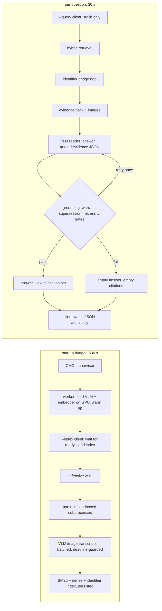

# SOURCEBOUND: AMD Mini-Challenge 3 research and specification

**Written:** 1 October 2026. **Sources checked:** 1 October 2026. **Status:** research and specification complete. No implementation or AMD measurements exist yet.

**Controlling sources:**
- The Mini-Challenge 3 brief, pasted into the session on 2026-10-01 (the "brief").
- The starter kit `mc3-starter-kit.zip` (repo root), which holds `CONTRACT.md`, `README.txt`, `sample-questions.json`, `selfcheck.py`, `setup.sh`, the starter container and the 13-file sample corpus.
- The general container rules in the [challenge PDF](../LabLab_AMD%20AI%20Challenge%20-%20Mini%20Challenge.pdf), Section 2. The text extract is in [challenge-extracted.txt](research/challenge-extracted.txt).
- The GPU access recorded in [COMPUTE.md](../COMPUTE.md) and [GPUWEBSKILL.md](../GPUWEBSKILL.md).

**Recommendation:** build a retrieval-and-verification pipeline that keeps models resident:
- **One resident worker** keeps a single BF16 vision-language model on the GPU, with a small embedding model.
- **The `--index` pass** parses every readable file once, transcribes every image with the VLM, and persists an index of chunks plus an identifier index.
- **Each `--query` call** is a stdlib-only client that sends the question to the worker over a unix socket.
- **The worker** retrieves candidates, follows identifier links one hop, and asks the VLM for an answer with verbatim supporting quotes. It then decides the answer and the citation set by **deterministic grounding and necessity rules, not by the model's say-so**.
- **Release reader:** Qwen3-VL-8B-Instruct (BF16, about 17.5 GB). Qwen3.5-9B is the challenger. The reader is chosen on a synthetic, harness-faithful evaluation that scores answer and citations as an exact set. Qwen3-VL-4B-Instruct, already in `/workspace` from Mini-Challenge 2, is the development reader.
- **The image** is published by **appending layers to the mandated base in the registry**, with `crane`. The weights are baked in, because MC3 has **no network at evaluation**. This preserves the base layers byte for byte and needs no 50 GB Docker build on a disk-limited runner.

The [ROADREAD specification](MINI_CHALLENGE_2_SPEC.md) is the template for this document. ROADREAD's resident-worker/thin-client architecture, remote GPU tooling and process-isolated evaluator carry over. Its download-at-startup fallback **does not**, because MC3 evaluation has no outbound network. The [SILENTPATH specification](SPEC.md) is unrelated.

## Problem Statement

The participant gets a folder of mixed, deliberately messy enterprise documents about fictional products. A model has never seen them. The participant must answer ten hidden questions about them.

**What scores.** Each question is worth 20 points and scores only when both parts are right:
- the **answer** matches after normalization;
- the **citations** match the expected set **exactly**.

There is no partial credit within a question. A correct value cited from the wrong file, or cited along with an extra file, scores zero. So does a refusal on an answerable question, or a guess on an unanswerable one. [Brief; CONTRACT.md]

**What is hard.** Model quality is not the main difficulty. The traps are:
- **Superseded documents.** A withdrawn datasheet r1 gives 105 °C; the current r2 gives 94 °C.
- **Near-miss rows.** A legacy TQ-20 fan sits next to the TQ-40 fan.
- **Decoy files.** Release notes are topically related but do not hold the fix version.
- **Multi-hop chains.** A log names a ticket; only the bug database gives that ticket's fix version. Its row is worded so that the question's own terms do not retrieve it.
- **Image-only facts.** A pin number and a board revision appear only inside images.
- **Unanswerable questions.** The answer may exist only inside an encrypted file, and a near-miss value (a part's unit cost) sits nearby.

**The corpus is hostile.** It contains an empty directory, an unreadable file (`chmod 000`, with `DAC_OVERRIDE` dropped so root cannot read it either), an encrypted PDF and an unknown binary type. One crash in the corpus walk silently drops every file after it, in directory-listing order. [Brief; README.txt; sample-questions.json]

**The process model is hostile.** Each question is a **new process** with a **30 s** budget. Model load and indexing must therefore happen inside the **10 min** startup budget: container start, model load and the `--index` pass together. The whole run of ten questions has **10 min**.

**The packaging is constrained:**
- **Size.** The image is ≤ 60 GiB uncompressed. The base alone is 29.2 GiB per CONTRACT.md.
- **VRAM.** Use 1–48 GiB, sampled continuously.
- **Base.** It must be the mandated ROCm base, checked by layer identity.
- **Network.** There is **no outbound network** while grading.

The development compute is a 3 h/day notebook pod on a Radeon Pro W7900D (gfx1100). That pod has no Docker. [CONTRACT.md; COMPUTE.md; GPUWEBSKILL.md §2]

## Solution

SOURCEBOUND runs inside the container as a resident worker.

**At startup it:**
1. loads the models onto the GPU;
2. on `--index`, walks the corpus defensively and parses each supported type into searchable segments;
3. transcribes every image with the VLM and builds lexical, dense and identifier indexes;
4. persists everything.

**For each question it:**
1. retrieves the most relevant files and follows any identifier link the evidence exposes (one hop);
2. shows the reader model a compact evidence pack, including the images themselves when an image file is a candidate;
3. requires the model to return a value plus verbatim quotes, each tagged as the **value** or a **link**;
4. checks that every quote really occurs in its file, that the answer occurs in the value quote, and that the quote actually states the asked attribute of the asked entity;
5. computes the citation set from the surviving quotes with an explicit necessity rule;
6. refuses with `{"answer": "", "citations": []}` when any gate fails.

### Approaches considered

| Approach | Advantage | Main limitation | Decision |
|---|---|---|---|
| Keyword search + hand-written regex extractors | Fast, no model | Overfits the sample wording. A competitor repo does exactly this (Further Notes E). The graded set is "different, larger, harder" | **Rejected.** No answer- or question-specific rules. |
| Classic RAG: top-k chunks → LLM answers and cites | Simple | The model cites what it retrieved, not what it needed. Prompt-only abstention fails under misleading context for small models [P1] | Baseline only. |
| **Retrieve → read with quotes → deterministic grounding, warrant and necessity gates** | Citations follow from verified evidence, and refusal is enforced by gates, not hoped for | More moving parts; needs a careful evaluation | **Build this.** |
| Whole corpus in context (long-context reader, cached prefix KV) | No retrieval misses; multi-hop comes free | Prefill cost and long-context accuracy of 8–9B models; the graded corpus size is unknown | **Experiment E5**, adopted only for corpora under a measured token threshold. |
| Text-only 14B reader + separate OCR model | Stronger reasoning | ~29.5 GB BF16 leaves no room for anything else under 60 GiB; two model stacks | Reserve only. |



### Expected visible behavior on the sample kit

The pipeline must reach these results without any sample-specific rule. The sample kit is a smoke test, not the target.

| # | What must happen | Mechanism |
|---|---|---|
| 1 | `94`, citing r2 only | Supersession gate: r1 is marked WITHDRAWN and a current sibling (r2) exists, so r1 is never cited |
| 2 | `Q3 FY27`, not `Q3` | Qualifier completion: the answer is expanded to the full quarter + fiscal-year span found in the source |
| 3 | `ORR-FAN-2214-B`, not the TQ-20 legacy row | Row serialization keeps header names; the warrant check confirms entity = TQ-40 |
| 4 | `4.3.2`, citing the CSV only | The question supplies ORR-1847 itself, so the log is not a link and is not cited |
| 5 | `E7731` | Log line chunking; the value quote contains the code |
| 6 | `180`, not the `60` in the comment | The reader is told comments can describe old values; the warrant check sees `DEFAULT_BATCH_TIMEOUT_S = 180` |
| 7 | `B14` from the PNG | The image transcript, plus the image itself sent to the reader |
| 8 | `REV-C2` from the JPG | Same; qualifier completion keeps `REV-` |
| 9 | `4.3.2`, citing log + CSV | The bridge hop finds ORR-1847 in the log; the identifier is not in the question, so the log is a necessary link |
| 10 | `""`, `[]` | The encrypted PDF is never indexed; the warrant check rejects the fan's unit cost as "unit price of the TQ-40" |

## User Stories

1. As the evaluator, I want `python3 /app/app.py --index /app/corpus` to finish successfully inside the startup budget, so that the run proceeds to the questions.
2. As the evaluator, I want every `--query` call to write `/app/output/<query-id>_output.json`, using exactly the id I passed, so that I can score it.
3. As the evaluator, I want every output to contain a string `answer` and a list `citations`, even on failure, so that a crash and a considered refusal can be told apart.
4. As the evaluator, I want each question answered in under 30 s from exec to file, so that no question times out.
5. As the evaluator, I want the container to stay running after all questions, so that I can exec into it repeatedly.
6. As the evaluator, I want the solution to use the GPU (1–48 GiB VRAM, sampled continuously), so that it satisfies the hardware rule without dummy buffers.
7. As the evaluator, I want the image to start from the mandated base, with its layers intact, so that it passes the layer-identity check.
8. As the evaluator, I want the image to be ≤ 60 GiB uncompressed, so that it passes the size gate.
9. As the evaluator, I want the solution to make no network request at evaluation, so that it works on an isolated network.
10. As a participant, I want an empty directory to be indexed as nothing without error, so that the walk continues.
11. As a participant, I want an unreadable file to be skipped with a record, so that every later file in listing order is still indexed.
12. As a participant, I want an unreadable *directory* skipped the same way, so that a permission error deeper in the tree cannot abort the walk.
13. As a participant, I want encrypted PDFs and encrypted Office files skipped entirely, even when an empty password would open them, so that nothing inside them can ever be used as an answer.
14. As a participant, I want files of unknown binary types skipped, so that garbage bytes never become evidence.
15. As a participant, I want a parser that hangs or explodes on a pathological file to be killed by a per-file timeout, so that one file cannot consume the startup budget.
16. As a participant, I want PDFs parsed page by page, including multi-page documents, so that a value on page 4 is retrievable and attributable.
17. As a participant, I want PDF pages without a text layer rendered and transcribed, so that a scanned datasheet is not invisible.
18. As a participant, I want `.docx` paragraphs **and tables**, plus headers and footers, extracted in document order, so that roadmap facts held in tables are found.
19. As a participant, I want every sheet of an `.xlsx` read, with formula results rather than formulas, so that a part number on the second sheet is found.
20. As a participant, I want spreadsheet and CSV rows serialized with their column headers on every row, so that a row retrieved alone still says which column is which.
21. As a participant, I want CSVs read with dialect and encoding detection, so that semicolon-separated or Latin-1 exports work.
22. As a participant, I want logs chunked by line windows with timestamps intact, so that an error code and its incident line stay together.
23. As a participant, I want Python source indexed with comments and constant names, so that a default value is found and distinguished from an old value named in a comment.
24. As a participant, I want every `.png`/`.jpg` transcribed by the vision model at index time, with labels kept next to what they label, so that image-only facts become searchable text.
25. As a participant, I want the actual image passed to the reader when an image file is a candidate, so that spatial relationships (which pin carries which signal) are read from the pixels, not only from a transcript.
26. As a participant, I want common text-like files (`.md`, `.json`, `.yaml`, `.html`, `.xml`, `.ini`, source code) treated as text, so that an obvious text format is not discarded as "unknown".
27. As a participant, I want identifiers tokenized whole and in parts (`ORR-1847`, `ORR1847`, `orr`, `1847`), so that lexical search matches codes however they are written.
28. As a participant, I want lexical and dense retrieval fused, so that both exact codes and paraphrased questions find their files.
29. As a participant, I want identifiers in the retrieved evidence that the question does not mention to be looked up in an identifier index, so that a chain like log → ticket → bug database is followed even when the second file shares no words with the question.
30. As a participant, I want the reader to be able to ask for one more lookup by identifier, so that a chain the deterministic hop missed can still be completed within the deadline.
31. As a participant, I want withdrawn or superseded documents labelled in the evidence and never cited when a current sibling exists, so that the supersession trap does not cost the question.
32. As a participant, I want the reader to answer only from the evidence, with verbatim quotes, so that every claim can be checked mechanically.
33. As a participant, I want every quote verified against the file's text, so that a fabricated quote cannot produce a citation.
34. As a participant, I want the answer required to appear in its value quote, so that a hallucinated value is refused rather than submitted.
35. As a participant, I want a short warrant check confirming that the quote states the asked attribute of the asked entity, so that a near-miss value (a part's cost offered as a product's price) is refused.
36. As a participant, I want the citation set computed from the value file plus only those link files whose identifier did not come from the question, so that citations follow necessity, not relevance.
37. As a participant, I want only one file cited when several files repeat the same value, so that an incidental mention is not cited as a source.
38. As a participant, I want the answer reduced to the value only (no sentence, no label, no unit) while keeping identifying qualifiers (`Q3 FY27`, `REV-C2`), so that it matches after normalization.
39. As a participant, I want a numeric answer stripped of its unit and degree sign but otherwise written as in the source, so that `94 °C` becomes `94` without reformatting `10,000`.
40. As a participant, I want a failed parse of the model's JSON retried once and then refused, so that malformed generations never leak into the answer.
41. As a participant, I want every query to finish under an internal deadline of about 25 s, with optional stages skipped as time runs out, so that a slow question degrades to a refusal instead of a timeout.
42. As a participant, I want the `--index` client to start the worker itself if it is not running, so that the solution works even if the container's CMD was overridden.
43. As a participant, I want a query that arrives before indexing finished to be answered from whatever is indexed, or refused, so that it never blocks past the deadline.
44. As a participant, I want the index persisted to disk and reloaded if the worker restarts, so that a worker crash between questions does not lose the corpus.
45. As a participant, I want a supervisor in the container's CMD to restart a crashed worker and keep the container alive, so that one fault does not end the run.
46. As a participant, I want the index pass to finish non-essential work (OCR of embedded images, reranker warm-up) only while startup time remains, so that the 600 s gate is never at risk.
47. As a developer, I want a synthetic corpus generator that recreates every trap with new fictional products, values and file names, so that I can measure generalization rather than memorize the sample.
48. As a developer, I want a locked holdout corpus that is evaluated once, so that the release decision is not overfit to development data.
49. As a developer, I want a scoring script that applies the official normalization and exact-set citation comparison, so that local scores mean what the grader's scores mean.
50. As a developer, I want results broken down by category (file type, trap, multi-hop, refusal) and by failure kind (wrong answer, under-citation, over-citation, false refusal, false answer), so that I fix the right thing.
51. As a developer, I want index time, per-question latency (p50 and max) and peak VRAM reported with every run, so that accuracy work never silently breaks a gate.
52. As a developer, I want every query's retrieval candidates, evidence pack, raw model output and gate decisions logged, so that a wrong citation can be traced to the stage that caused it.
53. As a developer, I want a fake engine behind the same engine interface, so that the walk, parsers, retrieval, gates and contract are tested on this Windows machine without a GPU.
54. As a developer, I want a CPU-only contract job in CI that runs the real client and worker (with the fake engine) under `--network none` and `--cap-drop DAC_OVERRIDE` on the sample corpus, so that the permission case is tested the way the grader runs it.
55. As a developer, I want the GPU workflow (sync, setup, models, worker, eval, pull, end) scripted on the existing Playwright tooling, so that sessions are cheap and always end with the pod turned off.
56. As a participant, I want the release image assembled by appending layers to the mandated base in the registry, so that base layers stay identical and no 50 GB local build is needed.
57. As a participant, I want weight layers split into chunks of at most 4 GiB, so that registry layer limits and upload timeouts are not hit.
58. As a participant, I want the published image rehearsed on the notebook from the exact pushed layers, so that what I tested is what the grader pulls.
59. As a participant, I want the image reference kept out of the public repository and CI logs, so that I follow the rule against advertising it.
60. As a participant, I want torch verified as the ROCm build after every dependency install, so that a silent CUDA torch replacement cannot reach the release.

## Implementation Decisions

### 1. Modules

A new package, SOURCEBOUND, lives beside ROADREAD and reuses its patterns. It does not import ROADREAD. Its modules are:

- **Client** (`/app/app.py`): stdlib only, never imports torch. It parses the two invocation shapes, talks to the worker, enforces the output schema and writes the file atomically.
- **Protocol**: newline-delimited JSON over a **unix socket**. It is stdlib only and shared by the client and the worker.
- **Supervisor**: the container CMD. It starts the worker, restarts it on crash (bounded), and never exits.
- **Worker**: loads the engine once, owns the index, and serializes requests.
- **Engine interface**, with two implementations:
  - **QwenEngine** for the GPU;
  - **FakeEngine** for tests: scripted, deterministic, no torch.

  The interface has three calls: `generate(messages with text and images, max_new_tokens, deadline) → text`, `embed(texts, kind=query|document) → matrix`, and `transcribe(images) → texts` (batched).
- **Walker**: a defensive corpus traversal. It yields file records and a skip ledger.
- **Parsers**: one per type (`pdf`, `docx`, `xlsx`, `csv`, `text/log`, `code`, `image`). Each returns **segments**: `{file, locator (page, sheet!row, line range, region), text, kind (prose|row|code|log|transcript), status flags}`. Parsers run in a subprocess pool so a hung parser can be killed.
- **Indexer**: chunks segments and builds three indexes:
  - BM25 over the identifier-aware tokenizer;
  - dense vectors on the GPU;
  - an identifier → segment index.

  It also builds document families for supersession and persists all of this.
- **Retriever**: hybrid search with reciprocal-rank fusion, file aggregation, and the bridge hop.
- **Reader**: builds the evidence pack and the prompt, parses the JSON reply, and runs the optional second hop.
- **Gates**: the deterministic grounding, supersession, answer-shape and necessity rules, plus the LLM warrant check.
- **Answer shaping**: value-only reduction and qualifier completion.
- **Evaluation**:
  - a corpus generator;
  - a harness-faithful runner: process per question, timed, official scoring;
  - a VRAM sampler;
  - reports.
- **Remote tooling**: an MC3 variant of the ROADREAD `remote.js` workflow.
- **Release tooling**: dependency and weight layer builders, `crane` append/mutate, and a rehearsal script.

### 2. Process model and the two invocations

**The CMD.** The CMD starts the supervisor, which starts the worker. The worker:
1. records its start time;
2. loads the engine with an explicit device (`cuda:0`);
3. runs one warm-up generation and one embedding;
4. if a persisted index matches the corpus fingerprint, loads it;
5. opens the socket and writes a ready file.

**`--index <dir>`.** The client:
1. If no socket or worker process exists, spawns the supervisor itself (detached) and waits.
2. Waits for ready.
3. Sends `index` with an absolute deadline of the worker start time + **540 s**.
4. Blocks until the worker reports done.
5. Exits 0 even when individual files were skipped.

The client exits non-zero only if the worker itself never became ready. Even then it first writes the skip ledger to stderr.

**`--query`.** The client:
1. Deletes any stale output.
2. Sends `query` with a deadline of **25 s** from its own start.
3. On a reply, writes it after validating types.
4. On any error (no worker, timeout, bad reply), writes `{"answer": "", "citations": [], "confidence": 0.0}`.
5. If the worker was absent, also triggers a background worker start so later questions can succeed.

Client overhead target: < 0.3 s.

**Ordering.** Requests are served one at a time. A query that arrives during indexing is refused immediately with reason `indexing in progress`, because the GPU is busy and waiting would only end in a timeout. The harness indexes before it asks, so this is a safety net, not a path that should score.

**Request shapes** (decision-rich parts only):

```json
{"op": "index",  "corpus": "/app/corpus", "deadline_epoch": 1790000000.0}
{"op": "query",  "corpus": "/app/corpus", "query_id": "query_01", "query": "...", "deadline_s": 24.5}
{"op": "status"}
→ {"ok": true, "answer": "94", "citations": ["specs/tq40_datasheet_r2.pdf"], "confidence": 0.91, "diag": {...}}
```

**Citations format.** Citations are corpus-relative POSIX paths, built from the corpus root used at index time and re-checked to exist under the `--corpus` given at query time.

### 3. Defensive corpus walk

- **Traversal.** Walk with `os.scandir` recursion, wrapped per entry, and do not follow symlinks.
  - A `PermissionError` or `OSError` on a directory listing records the directory as skipped and continues.
  - Sort entries for determinism. Correctness must not depend on the order.
- **Per-file isolation.** Each file is handled inside its own exception boundary:
  1. stat;
  2. open-and-read probe;
  3. type detection;
  4. parse in a subprocess, with a timeout of **20 s** and a size cap of **64 MB** (both configurable).

  Every outcome is recorded in a **skip ledger** with path, reason and elapsed time, and the ledger is persisted with the index.
- **Type detection.** Use the extension first, then confirm with magic bytes:
  - `%PDF`;
  - a ZIP with `[Content_Types].xml` for OOXML;
  - PNG/JPEG signatures.

  A mismatch is treated as unknown. Unknown extensions are parsed as text only when the file is on a text-format allowlist (`.md .json .yaml .yml .toml .ini .cfg .conf .html .htm .xml .rst .sh .js .ts .c .h .cpp .java .go .rs .sql`) **and** decodes as UTF-8 with ≥ 95 % printable characters. All other files are skipped. `.dat` and similar binaries are skipped.
- **Encryption** (always skip, never attempt a password):
  - a PDF whose `needs_pass` or `is_encrypted` is true, or whose `metadata["encryption"]` is set. The last check is needed: measured on PyMuPDF 1.27 on 2026-10-01, a PDF with only an owner password opens without one and reports `is_encrypted == False`, and only the metadata reveals it;
  - an OOXML file that is actually an OLE compound file (`D0 CF 11 E0`, the format of encrypted Office documents);
  - a ZIP with encrypted members.

  The brief states that nothing inside an encrypted file is ever an answer, and sample question 10 penalizes reading one.
- **Other edge cases.** An empty directory yields nothing. A zero-byte file is recorded and skipped.

### 4. Parsing and chunking per type

- **PDF.** Use PyMuPDF (abi3 wheel, works on Python 3.14). Extract text per page, keeping reading order (blocks sorted).
  - A page with < 20 characters of text but a drawing or image is rendered at 150 dpi and sent to the image transcriber. This is budgeted (§7).
  - A segment is about one page. Pages longer than the chunk limit are split on paragraphs with overlap.
  - The page number is the locator.
- **DOCX.** A stdlib ZIP and XML reader (no python-docx or lxml dependency) walks `w:body` in order:
  - paragraphs become prose;
  - each table row becomes a row segment, prefixed with the table's header row;
  - headers, footers, footnotes and text boxes are included.

  Embedded images in the media folder are queued for transcription at the lowest priority.
- **XLSX.** Use openpyxl, `read_only=True` and `data_only=True` so cached formula values are read.
  - Every sheet is read.
  - The header row is the first row with ≥ 2 non-empty cells.
  - Each data row becomes `sheet=<name> | <header>: <value> | …`.
  - Cells outside the table (notes, titles) become prose segments.
  - The locator is `sheet!row`.
- **CSV.** Try encodings `utf-8-sig`, then `cp1252`, then `latin-1`. Detect the dialect with `csv.Sniffer` on the first 64 KB, falling back to a comma.
  - The first row is the header unless the sniffer says otherwise.
  - Rows are serialized as for XLSX.
  - Very wide or long tables are chunked by row groups that always carry the header.
- **TXT/LOG.** Decode with the same encoding fallbacks.
  - Files ≤ 2 KB are one segment.
  - Otherwise use windows of 24 lines with 6-line overlap.
  - Log lines keep timestamps and host/process prefixes.
- **Code (`.py`, and other code on the allowlist).** Small files (≤ 3 KB) are one segment. Otherwise there is one segment for module-level statements and comments, plus one per top-level function or class (from `ast` when it parses, otherwise line windows).
- **Images** (`.png .jpg .jpeg`; `.tif`, `.bmp`, `.gif` and `.webp` when Pillow opens them):
  - **Load.** Use EXIF orientation and convert to RGB. Images are capped at about 2 MP for transcription.
  - **Transcription prompt.** The VLM is asked to transcribe *all* printed text exactly, keeping each label next to the thing it labels (`B14 — THERM_ALERT#`, `BOARD REVISION: REV-C2`). It then adds one sentence on what the image shows.
  - **Segment.** The transcript is a `transcript` segment, locator `image`. The image path is kept so the reader can receive the pixels at query time.
- **Status flags.** Every file gets `status` from its file name and first-page/first-500-character text:
  - `WITHDRAWN` matches `withdrawn|superseded|obsolete|deprecated|do not use|do not design`;
  - `DRAFT` and `CURRENT` are the other values.

  A heading line that describes **another** document does not mark this file. "supersedes revision 1" and "Revision 1 is withdrawn" are both ignored for the file that contains them.

  **Document families** group files whose names differ only by a revision token (`r1/r2`, `rev A/rev B`, `v1/v2`). Dates are **not** revision tokens: daily logs are separate documents, not revisions of one another. Within a family, the highest revision without a withdrawal marker is current, and any older revision is `SUPERSEDED`.

### 5. Retrieval

- **Tokenizer.** Lowercase, and keep compound tokens matching `[A-Za-z0-9]+(?:[-_.#/][A-Za-z0-9]+)*` whole. Additionally emit:
  - their parts;
  - a de-punctuated form (`orr-1847 → orr1847`);
  - for versions, the dotted form as is.

  English stopwords are removed only from the query side.
- **BM25.** Use k1 = 1.2 and b = 0.75 over segments. File path tokens are added to every segment of the file, so `bug_database`, `datasheet` and `roadmap` help.
- **Dense.** Qwen3-Embedding-0.6B (BF16, GPU), with an instruction prefix on queries per its model card. Segment vectors are computed at index time and kept on the GPU. The challenger is Qwen3-VL-Embedding-2B, used only if image retrieval through transcripts proves weak.
- **Fusion and file ranking.**
  - Fuse with reciprocal-rank fusion (k = 60) over the top 50 of each retriever.
  - A file's score is its best segment's fused score plus 0.1 × the second best.
  - `WITHDRAWN` files in a family with a current sibling are multiplied by 0.5. They are not removed, so the reader can see the conflict.
- **Optional reranker.** Qwen3-Reranker-0.6B over the top 30 segments. This is experiment E5; it is adopted only if it raises strict score.
- **Bridge hop** (deterministic):
  1. From the top 6 files' top segments, extract identifier-like tokens: letters and digits joined by `-`/`_`, codes like `E7731`, part numbers.
  2. Keep only tokens that are not in the question (normalized) and that occur in ≤ 3 files.
  3. Look each one up in the identifier index.
  4. Add the matching segments, up to 6, annotated `linked by <ID> from <file>`.
- **Reader-requested hop.** If the reader returns `status: "need_lookup"` with identifiers, run one more identifier lookup and one more reader call, but only if ≥ 10 s remain (`SB_MIN_CALL_S`; one 8B call takes up to about 10 s).

### 6. Reader, evidence pack and output contract

**Evidence pack.** At most 8 files and about 10 k tokens, in fused-rank order. Each file block opens with a header such as:

```
[F2] path=support/bug_database.csv type=csv status=CURRENT
```

or, for a withdrawn file:

```
[F5] path=specs/tq40_datasheet_r1_WITHDRAWN.pdf status=WITHDRAWN superseded_by=specs/tq40_datasheet_r2.pdf
```

- **What goes in a block.** Files under about 1,500 tokens are included whole. Larger files contribute their top segments plus neighbours, and row segments always carry their header.
- **Image candidates.** These contribute their transcript. Image files ranked in the top 4 also attach the image itself (resized to ≤ 1.9 MP). At most 3 images go into one call; lower-ranked images cost vision tokens for nothing.
- **Bridged segments** are marked with their link.

**Prompt rules.** These are stated once, briefly:
- answer only from the documents;
- the products are fictional, so outside knowledge is wrong;
- return the value only;
- keep identifying qualifiers exactly as printed;
- drop units;
- comments can name superseded values;
- a WITHDRAWN document is not authoritative;
- make sure the entity and the attribute match the question exactly;
- if the documents do not state it, return `not_found`.

Thinking is disabled. Decoding is greedy, with ≤ 200 new tokens.

**Reply schema.** This is the decision; the wording of the prompt is tuned in evaluation:

```json
{"status": "answered | not_found | need_lookup",
 "answer": "Q3 FY27",
 "answer_type": "extracted | derived",
 "evidence": [{"file": "F1", "quote": "TQ-60 enters customer sampling in Q3 FY27", "role": "value | link"}],
 "lookup": ["ORR-1847"]}
```

The parser extracts the first balanced JSON object and tolerates code fences. On a parse failure it retries once with a shorter instruction, and then refuses.

### 7. Gates: answer and citations are decided here, not by the model

Gates run in this order. Any failure leads to one retry with feedback, when time allows, and otherwise to refusal.

1. **Grounding.**
   - Each quote is normalized (case, whitespace, Unicode quotes and dashes) and must occur in the cited file's text or transcript. Exact substring match first, then fuzzy ≥ 0.90 over a sliding window.
   - Quotes that fail are dropped.
   - If no `value` quote survives, refuse.
2. **Answer-in-evidence.** For `extracted` answers, the answer under official normalization must occur, on token boundaries, in a surviving value quote. If it does not, it is checked against the **segment that contains the quote** (its row, page or line window), **never the whole file**. A local test showed why: with a whole-file fallback, `4.3.1` was accepted against an ORR-1847 quote because another row of the same CSV contains it. `derived` answers (arithmetic over quoted numbers) are allowed only when experiment E4 shows they help. Otherwise they are refused.
3. **Supersession.**
   - A value file marked `WITHDRAWN` with a current family sibling in the corpus is rejected.
   - The retry runs with the withdrawn file removed from the pack.
   - If the current sibling does not support an answer, the question is refused.
4. **Warrant check.** This is one short LLM call: the question, the answer and the value quotes (plus link quotes), with about 400 tokens of input and a one-word output. It asks: *"Does this evidence state the requested attribute of the requested entity, with this value? YES or NO."* A NO refuses. The check is ON by default because the refusal-with-decoy pattern (Q10) is graded, and prompt-only abstention is unreliable for small models [P1, P6].
5. **Necessity → citation set.**
   - **The value file.** Exactly one, the first surviving value quote's file. A second value file is kept only when `answer_type = derived` and both files' numbers are used.
   - **Link files.** Each must have a surviving `link` quote whose identifier also appears in the value quote or value segment, **and** that identifier must not appear in the normalized question. If the question supplied the identifier, the link file is not necessary.
   - **Implied link.** If the value segment entered the pack **only** through the bridge hop, the bridge's source file is added as a link even without a link quote. The chain was then the only route to the value.
   - **Everything else is dropped:** files that only repeat the value, topical neighbours and the remaining retrieval.
6. **Optional ablation check** (experiment E5). For answers citing ≥ 2 files, or with confidence < 0.6, re-ask with each cited file removed. A file whose removal leaves the same answer is dropped as not necessary. This is the counterfactual form of the necessity test [P8].

**Answer shaping** happens before grounding. It is deterministic and never a lookup table:
- Strip surrounding quotes, backticks, trailing punctuation and leading labels such as `pin`, `version`, `firmware`, `part number`, `answer:`.
- Remove units only from a *number + unit* pattern (`94 °C → 94`, `180 s → 180`, `4.1 TB/s → 4.1`).
- **Qualifier completion.** If the source contains the answer as part of a larger identifier token, expand to that token: a hyphen- or underscore-joined token such as `C2 → REV-C2`, or a quarter followed by a fiscal year such as `Q3 → Q3 FY27`.
- Never expand across spaces otherwise. `4.3.2` must not become `Meridian 4.3.2`.

**Confidence** is recorded and unscored. It is computed from retrieval margin, gate outcomes and the warrant check.

### 8. Models, precision and resources

**Precision.** BF16 only, with SDPA attention and no FP8 or GPTQ. The grading GPU may be gfx1100 (RDNA3, no FP8 matrix units) or gfx942; the base image supports both. [CONTRACT.md; ROADREAD spec §1]

**Reader and transcriber.** One VLM serves both roles:

| Role | Checkpoint | Size (BF16) |
|---|---|---|
| Development | Qwen3-VL-4B-Instruct | 8.3 GB, already in `/workspace` |
| Release default | Qwen3-VL-8B-Instruct | ≈ 17.5 GB |
| Challenger | Qwen3.5-9B, thinking disabled | ≈ 19.3 GB |

The release default uses standard attention. Its OCR evidence is strong: DocVQA 96.1 on the model card summary [W2]. The challenger is a natively multimodal hybrid-attention model; its linear-attention path on ROCm must be measured for speed. Choose by strict score on the development corpora. Larger dense or FP8/MoE models are excluded by size or precision (Further Notes D).

**Embedder.** Qwen3-Embedding-0.6B (≈ 1.2 GB).

**Optional reranker.** Qwen3-Reranker-0.6B (≈ 1.2 GB).

**Image budget:**

| Component | Size |
|---|---|
| Mandated base | 29.2 GiB per CONTRACT.md, to be re-measured exactly (gate G1) |
| Python dependencies | ≤ 1.5 GiB |
| Weights | ≤ 24 GiB |

The total target is ≤ 56 GiB, which leaves ≥ 4 GiB of margin under 60 GiB.

**VRAM.**
- The models stay resident for the whole run (≈ 20 GB). This satisfies the 1 GiB floor honestly; no dummy buffers.
- Peak target ≤ 40 GiB, covering the reader's KV cache at about 12 k tokens, image activations and batched transcription.
- Check the KV cost per token from the chosen model's config. About 0.15 MB per token for an 8B model with 36 layers, 8 KV heads and head dimension 128.

**Offline.** The image sets `HF_HUB_OFFLINE=1` and `TRANSFORMERS_OFFLINE=1`, and every `from_pretrained` uses a local path with `local_files_only=True`. No code path imports a network client.

**Dependencies:**
- **Locked, installed with `--no-deps`:** the transformers 5.x stack from the ROADREAD lock (transformers, tokenizers, safetensors, huggingface_hub, regex, PyYAML, …), plus pymupdf and openpyxl (et_xmlfile).
- **Installed into `/app/pylib`:** that directory is put first on `PYTHONPATH`. Never install into the base venv.
- **Assertion after install:** `'rocm' in torch.__version__` and torch is imported from the base venv. This is the brief's CUDA-torch trap.

### 9. Time budget

| Phase | Budget | Notes |
|---|---|---|
| Container start → worker ready | ≤ 120 s | Load ≈ 20 GB from the image layer, plus warm-up. Measure in rehearsal |
| Text parsing (subprocess pool, 8 workers) | ≤ 60 s for 500 files | The per-file timeout bounds the worst case |
| Image and page transcription | Remaining budget until worker start + 480 s | Batched (batch size from E1). Files first, then text-less PDF pages, then embedded DOCX/PDF images. Anything left over gets a filename-only stub and is transcribed lazily at query time if it is retrieved |
| Embedding + persist | ≤ 30 s | |
| Query, internal deadline | 25 s | Retrieval < 0.5 s; reader ≈ 3–8 s; warrant check ≈ 1–2 s; retry or second hop only if ≥ 8 s remain |

### 10. Build and release

**Where the image is built.** The notebook has no Docker. The base image is 29.2 GiB, and GitHub-hosted runners have about 25–29 GB of free disk [W5]. A conventional `docker build` is therefore not the release path.

**How the image is assembled.** The release is assembled **in the registry**. `crane append` pushes new layer tarballs on top of `rocm/pytorch:rocm10.0_ubuntu26.04_py3.14_pytorch_release_2.13.0`, and `crane mutate` sets the configuration. Base layers are referenced, not rebuilt, so the layer-identity check sees them unchanged. This is not squashing: the brief forbids flattening, not appending. [W6; challenge PDF Section 2]

**Layers:**
1. dependencies (`/app/pylib`);
2. application (`/app/app.py`, the package, `/app/requirements.txt` for transparency, and the supervisor);
3. weights, in layers of ≤ 4 GiB (GHCR caps layers at 10 GB and uploads at 10 min; Docker Hub degrades above about 10 GB) [W7].

**Configuration:**
- `WORKDIR /app`;
- `CMD` = the supervisor;
- `PYTHONPATH=/app/pylib:/app`;
- the offline variables;
- `/app/corpus`, `/app/output` and `/app/index` created in the application layer.

**Where crane runs.** In a GitHub Actions workflow:
1. download the weights from Hugging Face at pinned revisions;
2. install dependencies with Python 3.14 using `pip install --target … --no-deps --only-binary=:all:` from the lock;
3. build the tarballs;
4. `crane append` and `crane mutate`;
5. push.

**Registry.** Docker Hub, because ROADREAD's CI already holds Docker Hub secrets and the base also lives on Docker Hub, so blob mounts avoid re-uploading the base.

**Keeping the reference private.** The repository name and tag come from **secrets**. They are never echoed, never written to the repository, and never put in the README. [Challenge PDF: "do not advertise where it lives"]

**Reference Dockerfile.** A Dockerfile that produces equivalent layers stays in the repository for anyone with a large-disk Docker host. It is documentation, not the release path.

**Rehearsal on the notebook.** The notebook pod runs the mandated base, so the rehearsal is faithful:
1. fetch only the appended layers of the pushed digest with `crane`;
2. extract them into the pod's (non-persistent) root;
3. run the image's CMD;
4. run the full harness sequence with a VRAM sampler: index timing, ten process-isolated queries, and a check that the container is still alive afterwards.

The rehearsal also tries two isolation checks:
- `unshare -n` (no network);
- `setpriv --bounding-set=-dac_override` or `capsh --drop=cap_dac_override` (permission).

If the pod lacks the capability to run them, the CI contract job (Testing Decisions) is the evidence for those two properties.

**Final check.** Compute the uncompressed size from layer metadata, by streaming each layer through `gzip -dc | wc -c`. Confirm that the base layer digests are an ordered prefix of the image's layers.

## Testing Decisions

### What a good test is

A good test drives **external behaviour through the highest seam**: the `/app/app.py` contract.

1. Create a corpus directory.
2. Run `--index` as a separate process.
3. Run `--query` as separate processes.
4. Read the JSON files.

Assertions cover the answer under official normalization, the citation set as an exact set, the presence and types of the keys, timing, and stale-file removal. Tests must not assert on internal data structures, prompt text or chunk boundaries. Those can change freely.

### Seams

1. **Primary seam: the harness contract** (CLI in → JSON file out), run against a worker.
   - **Locally and in CI**, the worker uses the **FakeEngine**. Its scripted reader replies are keyed by question substring. Its embeddings are deterministic hashed vectors. Its transcripts are taken from a sidecar fixture map, used only in tests.
   - **On the GPU**, the same seam runs with QwenEngine. That is the evaluation.
2. **Engine interface** (`generate` / `embed` / `transcribe`). This is the only internal substitution point. No other module is mocked.

Parsers, retrieval and gates are exercised through seam 1 with purpose-built corpora: for example, a corpus where the fake reader cites a withdrawn file must produce the current file's citation. Focused unit tests are allowed for pure functions whose cases are easier to enumerate directly: normalization, answer shaping, the tokenizer, identifier extraction and encryption detection.

**Prior art in this repository:**
- the ROADREAD fake-engine pipeline tests and protocol/thin-client tests;
- the process-isolated `run_eval.py` evaluator;
- the `remote.js` GPU workflow.

The new tests follow the same style: pytest, no GPU, under one second each where possible.

### Contract and robustness tests (no GPU)

- **Starter-kit corpus with the hazards recreated.** On Linux CI, use `setup.sh`. On Windows, simulate the permission error by injecting `PermissionError` through the walker's file-open hook. Expected results: indexing completes, all other files are indexed, the ledger lists the 3 hazards, and the empty directory is harmless.
- **Order independence.** Rename files so the unreadable one sorts first, then last. Everything else is still indexed.
- **Encryption.** A PDF encrypted with an empty user password and an owner password (it *opens*) is still skipped. So are an OLE-container `.xlsx` and an encrypted ZIP member.
- **Hang and size limits.** A parser stub that sleeps past the timeout, and an oversized file, are both recorded and skipped, and indexing finishes.
- **Output contract.** Worker absent, worker timeout, malformed reply, a query before indexing finished, and a stale output file. In every case the file exists with `answer: str` and `citations: list`.
- **CI contract job (GitHub Actions, CPU).** Run inside `python:3.14-slim` with the pinned parser dependencies and the FakeEngine, as **root**, with `--network none --cap-drop DAC_OVERRIDE`, against the starter-kit corpus after `setup.sh`. This is the grader's permission condition, reproduced honestly.
- **Static check.** Grep the client and protocol for forbidden imports (torch, transformers, PIL, network libraries).

### Evaluation corpora (GPU)

A seeded generator writes complete corpora that follow the sample conventions. Each corpus has a new fictional company, new product names and new values. **No string from the sample answers is reused.** Each corpus has 20–40 files across all required types plus the four hazards, and 12–16 questions with expected answers and exact citation sets.

Question categories and their target share:

| Category | Share |
|---|---|
| Single-hop per file type (pdf incl. page ≥ 3 of a multi-page file, docx paragraph, docx table, xlsx second sheet, csv, log, py constant vs. comment, png diagram, jpg photo/label with rotation, noise and JPEG artefacts) | 45 % |
| Supersession (withdrawn/current revision pair) | 10 % |
| Near-miss row or entity | 10 % |
| Two-file chains through an identifier (log → ticket → fix; part → lead time; error code → runbook), with the bridging row worded so the question terms do not retrieve it | 15 % |
| Questions that supply the identifier themselves, where the single-file citation is correct | 5 % |
| Unanswerable: the answer exists only in an encrypted, unreadable or unknown-type file; an attribute present only for a sibling entity; a near-miss numeric decoy | 15 % |

**Splits:**
- **Development:** 4 corpora, about 56 questions.
- **Holdout:** 2 corpora, about 28 questions, locked and evaluated once at freeze.
- **Smoke:** the 10 sample questions.
- **Scale:** one large corpus (about 400 files, including 40 images and 20 multi-page PDFs), used **only for timing**: index time under the startup budget and query latency.

**Metrics:**
- **Primary:** strict score, the count of questions with answer *and* citations exactly right, reported as points out of 20 × n.
- **Secondary:** answer accuracy; citation exact-set accuracy; refusal precision and recall; over-citation and under-citation counts; per-category strict score.
- **Always reported:** index time, startup-to-ready time, per-query p50 and maximum latency, peak VRAM (sampled at 1 s), and contract violations.

### Experiments (each must be able to change a decision)

- **E0: gates (GPU session 1).** See Further Notes G.
- **E1: baseline.** Development reader with BM25 only and a single reader call with the grounding and necessity gates. Measure the transcription batch size against latency. **Exit criterion:** 10/10 on the smoke set with no sample-specific code, *or* a written list of the failures with their stage.
- **E2: dense and fusion.** Add the embedder and RRF. Adopt if strict score rises and no category regresses by more than 1 question.
- **E3: multi-hop.** Deterministic bridge hop, then the reader-requested hop. Measure the chain category and over-citation.
- **E4: release reader.** Qwen3-VL-8B against Qwen3.5-9B against the 4B baseline, on identical corpora. Also test whether `derived` answers help. Choose by strict score, then by worst-case latency.
- **E5: optional extras.** Reranker; ablation check; whole-corpus-in-context mode with a cached prefix for corpora under a measured token threshold [P5, P10]. Each is adopted only on a strict-score gain with ≤ 25 s worst-case latency.
- **E6: freeze.** Holdout evaluated once, the release build, the rehearsal and the scale-corpus timing.

**Adoption rule.** A change is kept only if it corrects more strict-score questions than it breaks on the development corpora, causes no category regression larger than one question, and stays within every resource limit.

### Acceptance checks for release

| Check | Required evidence |
|---|---|
| Base identity | Base layer digests are an ordered prefix of the pushed image's layers (`crane manifest`/`config`) |
| Size | Uncompressed sum ≤ 60 GiB with ≥ 2 GiB margin, measured by streaming layers |
| torch | `torch.__version__` ends with `+rocm…` when imported with the image's `PYTHONPATH` |
| Startup | Rehearsal: CMD start → `--index` done ≤ 480 s on the scale corpus; ≤ 300 s on the sample corpus |
| Per question | Max ≤ 25 s across all development and holdout questions, measured from client exec to file |
| Whole run | 10 questions ≤ 240 s |
| VRAM | Peak between 1 and 44 GiB, sampled at 1 s during index and queries |
| Hazards | CI contract job green (no network, DAC_OVERRIDE dropped, as root) |
| Smoke | 10/10 strict on the sample kit |
| Generalization | Holdout strict score reported once, with its failure analysis |
| Liveness | The container (rehearsal process tree) is still running after all questions; supervisor restarts are tested by killing the worker |
| Secrets | No `.env`, token or image reference in the image or the repository |

## Out of Scope

- Fine-tuning, LoRA or training of any model.
- Opening encrypted files with any password, including empty or guessed ones.
- vLLM, SGLang or llama.cpp serving stacks. They are not in the base, a Python 3.14/ROCm build is a risk, and transformers is fast enough for ten questions. vLLM can be revisited only if E4/E5 show the reader is the latency bottleneck.
- A graph database, an external vector database or a framework (LangChain, LlamaIndex). In-process BM25 plus torch vectors are enough at this scale.
- File types not listed by the brief beyond the cheap text allowlist: `.pptx`, `.doc`, `.xls`, audio, video.
- Answer formats beyond a short value: lists, prose and multi-value answers.
- Any network access at evaluation. Any use of the image reference in public material.
- A web UI or demo for MC3.

## Further Notes

### A. Exact contract (from the brief, CONTRACT.md and the starter kit)

**Invocations:**
- `python3 /app/app.py --index /app/corpus`, once, inside the startup budget.
- `python3 /app/app.py --corpus /app/corpus --query-id <id> --query "<text>"`, once per question, as a new process.

**Output:** `/app/output/<query-id>_output.json` with:
- `answer` (string, required, empty on refusal);
- `citations` (list of strings, required, empty on refusal; absolute or corpus-relative);
- `confidence` (number, optional, unscored).

A missing key is malformed and scores zero.

**Normalization:** uppercase, remove whitespace, remove `- . · _`. The contract says units and degree signs are "normalised away" (`94`, `94 C` and `94°C` all match). The safe policy is to emit the bare number.

**Limits:**
- startup 600 s (container start + model load + `--index`);
- 30 s per question;
- 600 s whole run;
- VRAM 1–48 GiB (1 % tolerance), sampled continuously, peak counts, dummy buffers detected;
- image ≤ 60 GiB uncompressed;
- base `rocm/pytorch:rocm10.0_ubuntu26.04_py3.14_pytorch_release_2.13.0`, checked by layer identity;
- **no outbound network during evaluation**.

**Path rules** (challenge PDF Section 2): `/app` holds the code including `app.py`, `/app/requirements.txt` holds dependencies, and `/models` holds shipped weights (optional).

**Starter details:**
- The starter `app.py` reads `MC2_OUTPUT_DIR`, a copy-paste leftover; SOURCEBOUND's client uses `/app/output` unless a test overrides it.
- `selfcheck.py` runs the container with `--network none`, copies the corpus in, runs `--index` (600 s timeout) and one query (30 s timeout), and validates the JSON.

### B. Sample corpus analysis (what each trap teaches)

Read on 2026-10-01 from the kit.

- **PDFs.** `tq40_datasheet_r1_WITHDRAWN.pdf` says "WITHDRAWN, SUPERSEDED BY REVISION 2… Do not design to these numbers" and gives 105 C. r2 says "supersedes revision 1" and gives 94 C. Supersession is visible in *both* the file name and the text.
- **XLSX.** Two sheets. Sheet 1 holds parts with columns `part_number, description, compatible_with, unit_cost_usd, lead_time_days`. Sheet 2 is a note. The near-miss row is `ORR-FAN-1990-A … (legacy) TQ-20`. The `unit_cost_usd` of 84.5 for the TQ-40 fan is a ready-made decoy for Q10 ("unit price of the TQ-40").
- **CSV.** The ORR-1847 summary ("Die temperature sensor reports high under sustained small-batch load") shares almost no words with "thermal throttle", by design.
- **Log.** `ERROR E7731: thermal throttle engaged…` and `incident logged against ORR-1847`.
- **Release notes.** These list 4.3.0, 4.3.1 and 4.3.3 and say the bug database is authoritative. They are a decoy that no longer contains `4.3.2`.
- **Python.** A comment says "Raised from 60"; the constant `DEFAULT_BATCH_TIMEOUT_S = 180`.
- **PNG.** A connector diagram: pins B11–B16 in boxes, with signal names underneath. B14 → THERM_ALERT#. The caption repeats the signal name but not the pin.
- **JPG.** A slightly rotated label: MODEL TQ-40, BOARD REVISION REV-C2, SN OS4-118823-77.
- **Hazards.** The encrypted PDF needs a password (`needs_pass = 1`). `telemetry_capture.dat` is the byte sequence 0x00…0xFF repeated. `internal_audit.txt` becomes mode 000 after `setup.sh`.

### C. Research findings that shape the design

Literature was searched on 2026-10-01 in two ways:
- web search restricted to arxiv.org;
- the arXiv Atom API, 12 queries, run with backoff after initial HTTP 429 rate limiting.

The IDs below are arXiv identifiers. P12–P17 come from the API results, whose abstracts were read.

- **[P1] Prompt-Based Abstention Fails Under Misleading Context: A Controlled Study of Small Frozen RAG Models** (arXiv 2608.22228). Small RAG models asked to abstain by prompt still answer when the context contains a plausible distractor. **Design impact:** refusal is enforced by grounding and warrant gates, not by the prompt alone (§7).
- **[P2] Unanswerability Evaluation for Retrieval Augmented Generation** (arXiv 2412.12300, ACL 2025). This is a benchmark framing of unanswerable-but-retrievable questions. **Design impact:** the generator includes "answer only in an unreadable source" and "attribute only for a sibling entity" categories.
- **[P3] Stale-Document Poisoning: When Outdated Retrieval Overrides Correct Model Answers** (arXiv 2609.31342), and **VersionRAG** (arXiv 2510.08109). Outdated documents in the context mislead models. Recency- and version-aware ranking helps, and a standard RAG reached only 58 % on versioned documents. **Design impact:** document families, `WITHDRAWN` labels in the pack, and a hard supersession gate (§4, §7).
- **[P4] HippoRAG** (arXiv 2405.14831) and **BridgeRAG** (arXiv 2604.03384). Single-step associative retrieval matches iterative retrieval at a fraction of the cost, and bridge-conditioned two-hop retrieval works with about 3 LLM calls. **Design impact:** a cheap deterministic identifier bridge first, with one optional reader-requested hop (§5).
- **[P5] Long Context vs. RAG for LLMs: An Evaluation and Revisits** (arXiv 2501.01880), and **Retrieval Augmented Generation or Long-Context LLMs? A Comprehensive Study and Hybrid Approach** (arXiv 2407.16833). Long context often wins on average with strong models, but open models benefit more from retrieval, and RAG wins on fragmented information. Routing between the two is effective. **Design impact:** whole-corpus mode is an E5 experiment for small corpora, not the default.
- **[P6] Relevant Is Not Warranted: Evidence-Force Calibration for Cited RAG** (arXiv 2605.28044), and **VeriCite** (arXiv 2510.11394). A relevant citation can fail to license the claim, so verification must check warrant. **Design impact:** the warrant check (§7.4).
- **[P7] Concise and Sufficient Sub-Sentence Citations for RAG** (arXiv 2509.20859). Citations should be both minimal and sufficient. **Design impact:** quote-level evidence with value/link roles, and the necessity rule.
- **[P8] Correctness is not Faithfulness in RAG Attributions** (arXiv 2412.18004). Models post-rationalize citations; a faithful citation is one whose removal changes the answer. **Design impact:** citations are computed from verified quotes, with the optional ablation check (§7.6).
- **[P9] Table serialization** (SpreadsheetLLM, arXiv 2407.09025; M3TQA, arXiv 2508.16265; FRTR, arXiv 2601.08741). Repeating column names on every serialized row helps a model read rows in isolation, at a token cost. **Design impact:** `header: value` row segments (§4).
- **[P10] Visually rich documents** (VisRAG, arXiv 2410.10594; "Lost in OCR Translation?", arXiv 2505.05666; "Index Light, Reason Deep: Deferred Visual Ingestion", arXiv 2602.14162). OCR-based pipelines generalize better to unseen documents than vision-embedding retrieval, and deferring expensive visual reading to query time is effective. **Design impact:** VLM transcripts for retrieval, plus the raw image for the reader at query time (§4, §6).
- **[P11] Multi-hop RAG amplifies upstream recognition errors** ("Better Retrieval, Worse Robustness", arXiv 2608.22872). Errors in the transcription stage propagate through hops. **Design impact:** identifier normalization (de-punctuated forms) in the bridge index, and the image itself sent to the reader.
- **[P12] EvidenT: Building Trustworthy Enterprise Assistants through Evidence Groundedness and Traceability** (arXiv 2609.22537). This lightweight pipeline verifies extracted evidence against retrieved documents with *deterministic lexical alignment* before answering. On about 500 enterprise queries it raised the gold-source hit rate by 29 % on average, with no citations to unretrieved sources. **Design impact:** this is the closest published analogue of the grounding gate (§7.1) and directly supports making it deterministic.
- **[P13] Sieve and Sage: Efficient Distraction Filtering for Reliable RALM Abstention** (arXiv 2609.35794). It splits retrieval failure into an *unanswerable* state (evidence absent) and a *distracted* state (relevant but conflicting or adversarial evidence present), and handles them with a cheap screen before the main model. **Design impact:** the encrypted-file case is unanswerable, and the unit-cost decoy is distracted. The warrant check is our cheap screen for the second.
- **[P14] IndexRAG: Index-Time Reasoning for Multi-Hop RAG** (arXiv 2603.16415). It identifies bridge entities across documents at index time, then answers with single-pass retrieval and one LLM call (+4.6 F1 over naive RAG). **Design impact:** the identifier index is built at index time, so the query-time bridge hop is a dictionary lookup.
- **[P15] Replace, Don't Expand: SEAL-RAG** (arXiv 2512.10787). Adding context to fix a missed bridge fact causes *context dilution*; replacing is better than expanding under a fixed budget. **Design impact:** the pack has a fixed character budget and caps on files, images and links, and a supersession retry *removes* the withdrawn file instead of adding text.
- **[P16] SciRet** (arXiv 2608.03860). Hybrid BM25 + dense with RRF was the most robust retriever across corpus scales, but an out-of-domain cross-encoder reranker *reduced* precision. **Design impact:** the reranker is an E5 experiment that must win on our own corpora, never a default.
- **[P17] Generation-Time vs. Post-hoc Citation** (arXiv 2509.21557). It finds a consistent trade-off between citation coverage and citation correctness. **Design impact:** the reader cites at generation time (quotes), and the gates act as the post-hoc verifier, keeping correctness over coverage.
- **Retrieval models.** Qwen3 Embedding / Reranker (arXiv 2506.05176) and Qwen3-VL-Embedding / Reranker (arXiv 2601.04720, 2B and 8B, January 2026). A practitioner report found that BM25 + dense RRF raised a small evaluation from 5/10 to 7/10, and a reranker took it to 8/10 [W4]. **Design impact:** hybrid retrieval by default, reranker as an experiment.

### D. Model screen (1 October 2026)

| Candidate | Size | Fit | Decision |
|---|---|---|---|
| Qwen3-VL-4B-Instruct | 8.3 GB | Already downloaded; 10/10 and 109/120 on MC2 OCR at ≈ 0.5 s | Development reader |
| **Qwen3-VL-8B-Instruct** | ≈ 17.5 GB | Standard attention; strong OCR/DocVQA [W2] | **Release default** |
| Qwen3.5-9B (released 2026-03-02) | ≈ 19.3 GB | Natively multimodal; thinking on by default (must disable); hybrid linear attention, ROCm speed unknown [W3] | Challenger in E4 |
| Qwen3.6-27B / Qwen3.8-27B (dense, multimodal) | ≈ 55 GB BF16 | Over the image budget; FP8 variants excluded on RDNA | Excluded |
| Qwen3.6-35B-A3B (MoE) | ≈ 70 GB BF16 | Over budget | Excluded |
| Qwen3-14B (text) + OCR model | ≈ 29.5 + 2 GB | Leaves no margin; two stacks | Reserve only |
| Qwen3-Embedding-0.6B / Qwen3-Reranker-0.6B | ≈ 1.2 GB each | Small, strong [P-retrieval] | Embedder default; reranker E5 |
| Qwen3-VL-Embedding-2B | ≈ 4 GB | Direct image embeddings | Only if transcript retrieval fails on images |

Sizes come from the ROADREAD screen and the model cards. Gate G2 re-confirms exact byte counts with `huggingface_hub` before the release decision.

### E. Competing public entries

**One public MC3 repository** (`amd-rag-challenge`, single commit, read 2026-10-01) uses:
- no LLM and no embeddings;
- keyword scoring plus **regular expressions keyed to the ten sample questions** (junction temperature 50–150, `Q[1-4] FY..`, `REV-…`, `E\d{4,5}`);
- one hard-coded multi-hop branch triggered by "production log"/"throttle";
- EasyOCR for images;
- an import-time `torch.empty((384,1024,1024), float32, cuda)` (≈ 1.5 GiB) "to meet" the VRAM floor, which the brief says is detected;
- a README that publishes the image reference;
- a CMD of `python3 /app/app.py --help`, which exits rather than staying alive.

It reports 200/200 on its own generated sample corpus.

**Lessons:**
1. The sample can be "solved" in ways that will not generalize, so a sample score is not evidence.
2. The VRAM floor must be met by real work.
3. Keep the image reference private.
4. Make sure the container stays up.

**ROADREAD (MC2), our own entry,** downloads weights at startup if they are absent. That was allowed in MC2, whose brief states that evaluation has outbound network. **It is not allowed in MC3.** SOURCEBOUND must bake its weights.

### F. Build-path analysis

**Building on the notebook.** The notebook has no Docker daemon. Rootless builders that unpack a base onto `/` (kaniko) would overwrite the notebook's own filesystem.

**Building on GitHub-hosted runners.** These have about 25–29 GB free [W5]. A `FROM` build of a 29.2 GiB base plus about 20 GB of weights needs well over that, even after removing preinstalled toolchains. The ROCm community reports that some ROCm-based Dockerfiles need far more scratch space [W5].

**Why `crane append` solves this:**
- it works entirely through registry API calls;
- it streams blobs;
- it mounts existing blobs within a registry;
- it never runs or unpacks the base [W6].

The weights must still pass through the runner's disk once per layer, at ≤ 4 GiB per layer. Download a shard group, tar it, append, delete, and repeat.

**Residual risk.** No Docker/GPU host runs the final image end to end. Mitigation:
1. the notebook rehearsal runs the exact appended layers on the same base;
2. the CI contract job runs the real client/worker code under the grader's isolation flags;
3. `selfcheck.py` is run if any Linux host with Docker and about 70 GB free becomes available.

### G. Gates and open items (first GPU session unless stated)

- **G1. Base image size, uncompressed.** Stream the base layers through `crane blob … | gzip -dc | wc -c` in CI. CONTRACT.md says 29.2 GiB. The ROADREAD `du` proxy measured 21.25 GB, which likely undercounts. Use the larger number until G1 is measured.
- **G2. Models.** On the notebook's Python 3.14 + ROCm torch 2.13 + transformers 5.17:
  - Qwen3-VL-8B-Instruct and Qwen3.5-9B load and generate with images;
  - Qwen3-Embedding-0.6B embeds;
  - record exact bytes, load time, tokens/s and the transcription batch-size curve.

  `/workspace` is 25 GB, so large candidates go to the ephemeral root (re-download at about 90 MB/s, ≈ 4 min) or replace the MC2 4B model.
- **G3. Parser wheels.** PyMuPDF and openpyxl install with `--no-deps --only-binary=:all:` for cp314, and import next to the ROCm torch.
- **G4. Isolation tools in the pod.** Are `unshare -n` and `setpriv`/`capsh` usable?
- **G5. Registry.** Push a ≥ 4 GiB layer with `crane append` from GitHub Actions to Docker Hub, and confirm anonymous pull of the tag.
- **G6. Deadline.** No MC3 closing date was found. The programme runs to 1 December 2026 [W8]. Check the signed-in challenge page before planning beyond two weeks.
- **G7. Grader aliases.** `sample-questions.json` lists aliases (`pin B14`, `Meridian 4.3.2`), but the published normalization would not equate them. Emit the bare canonical value and never rely on aliases.

### H. Compute-aware execution order

- **Local (no GPU):** the contract, walker, parsers, retrieval, gates and generator, with the FakeEngine and the CI job.
- **GPU session 1 (≤ 150 min):** gates G2–G4, dependency lock, E1 on the development reader.
- **Sessions 2–3:** E2, E3, E4.
- **Session 4:** E5 and freeze.
- **Session 5:** release rehearsal from the pushed image.

Every session ends with `remote end` (pod off) and records the quota at start and end. One large checkpoint is held at a time.

### I. Web sources

- [W1] Competitor repository: https://github.com/sahariarhossain524-sketch/amd-rag-challenge
- [W2] Qwen3-VL-8B-Instruct model card and small-VLM comparisons: https://huggingface.co/Qwen/Qwen3-VL-8B-Instruct ; https://tinyweights.dev/posts/best-local-vision-language-models-2026/
- [W3] Qwen3.5-9B model card (thinking default, `enable_thinking=False`): https://huggingface.co/Qwen/Qwen3.5-9B
- [W4] Hybrid retrieval with Qwen embeddings, BM25 and RRF: https://dev.to/futhgar/hybrid-retrieval-v2-qwen-embeddings-bm25-and-rrf-with-a-fastembed-reranker-1702 ; Qwen3-Reranker-0.6B: https://huggingface.co/Qwen/Qwen3-Reranker-0.6B
- [W5] Runner disk space and ROCm image size: https://github.com/ROCm/ROCm/issues/2093 ; https://carlosbecker.com/posts/github-actions-disk-space/
- [W6] crane append/recipes: https://github.com/google/go-containerregistry/blob/main/cmd/crane/recipes.md
- [W7] GHCR layer and upload limits: https://github.com/orgs/community/discussions/77429
- [W8] Programme dates: https://lablab.ai/ai-hackathons/amd-lablab-ai-academy-challenge ; [hackathon rules note](hackathon-rules-2026-09-28.md)
- Transformers prefix-cache reuse (for E5): https://huggingface.co/docs/transformers/en/kv_cache
